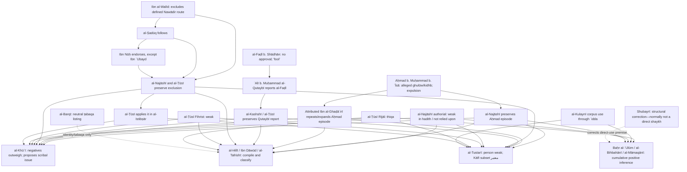

# Case 2 — Sahl b. Ziyād: when the sources genuinely conflict

## Case result

This case does **not** support a single, method-neutral label such as “reliable” or “weak.” The early record contains a real contradiction:

- al-Ṭūsī's extant *Rijāl* calls Sahl `ثقة`;
- al-Ṭūsī's *Fihrist* calls him `ضعيف`;
- al-Najāshī calls him `ضعيفا في الحديث، غير معتمد فيه` and reports Aḥmad b. Muḥammad b. ʿĪsā's accusations of `الغلو والكذب`;
- al-Ṭūsī himself applies a severe criticism to a particular route through Sahl under his kunya, `أبو سعيد الآدمي`, in *al-Istibṣār*;
- al-Faḍl b. Shādhān's reported `لا يرتضيه ... هو الأحمق` is a different kind of criticism again;
- al-Kulaynī nevertheless makes Sahl a major conduit in *al-Kāfī*.

Those statements must not be flattened. `ضعيف في الحديث`, alleged lying, alleged ghulūw, narrating mursal material, intellectual disparagement, exclusion of a route from *Nawādir al-ḥikma*, and a compiler's extensive use are different claim types with different dependencies.

The defensible engine-level result is therefore:

| Layer | Resolution |
|---|---|
| Identity | The full-name occurrences `سهل بن زياد الآدمي الرازي` and the kunya `أبو سعيد الآدمي` in the cited sources refer to the same historical person. **High confidence.** |
| Person reliability, strict explicit-evidence profile | Conflict is preserved; because the negative evidence is multiple and the one explicit tawthīq is itself disputed, Sahl is at minimum **not established as thiqa**, and is treated as weak by al-Khūʾī. |
| Person reliability, cumulative-qarāʾin profile | al-Bihbahānī and al-Māmaqānī regard the aggregate of al-Ṭūsī's tawthīq, compiler practice, quantity, and prominent transmission as enough for reliance or ḥusn, after reinterpreting the negative formulas. |
| Reports in *al-Kāfī*, al-Tustarī profile | The person remains weak, but the subset selected by al-Kulaynī is treated as معتبر because of al-Tustarī's reading of al-Kulaynī's compilation aim. This is report-level authentication, not person-level tawthīq. |
| Any individual report | Must still be evaluated for irsāl, parallel paths, source route, other narrators, and content evidence. Sahl's presence neither proves fabrication nor guarantees validity. |
| Cross-method answer | **Disputed / methodology-dependent**. If the product must expose one neutral state, use `tawaqquf_conflicting_evidence`, not a majority vote. |

The doctrinal and dishonesty allegations should be stored as **attributed allegations**, not as settled biography. The corpus establishes extensive use; it does not by itself establish either personal reliability or fabrication.

## 1. Person and name forms

The case concerns:

- `سهل بن زياد الآدمي الرازي`
- kunya: `أبو سعيد`
- abbreviated Four Books form: `سهل بن زياد`
- source-critical alias: `أبو سعيد الآدمي`

The identification is unusually secure because al-Najāshī, al-Ṭūsī and al-Kashshī join the name, kunya, nisba and geography. The engine should retain each literal form as a `NarratorOccurrence`, then link it to the same `HistoricalPerson` by explicit source claims. It must not normalize the *Istibṣār* phrase `أبو سعيد الآدمي` away before search: that is precisely where al-Ṭūsī's applied criticism appears.

## 2. Literal Four Books occurrences

These are literal texts, not reconstructed chains. Printed numbering and pagination follow the linked editions. The local project identifiers are included so that a builder can reproduce the corpus query.

### 2.1 *al-Kāfī*

1. `alkafi-2`, no. 2, vol. 1, p. 10:

   > `عَلِيُّ بْنُ مُحَمَّدٍ عَنْ سَهْلِ بْنِ زِيَادٍ عَنْ عَمْرِو بْنِ عُثْمَانَ عَنْ مُفَضَّلِ بْنِ صَالِحٍ عَنْ سَعْدِ بْنِ طَرِيفٍ عَنِ الْأَصْبَغِ بْنِ نُبَاتَةَ عَنْ عَلِيٍّ ع قَالَ:`

   Al-Kulaynī, *al-Kāfī*, ed. ʿAlī Akbar al-Ghaffārī and Muḥammad al-Ākhūndī, Dār al-Kutub al-Islāmiyya, Tehran, 4th ed., 1407 AH, [vol. 1, p. 10](https://lib.eshia.ir/11005/1/10).

2. `alkafi-13`, no. 13, vol. 1, p. 20:

   > `عَلِيُّ بْنُ مُحَمَّدٍ عَنْ سَهْلِ بْنِ زِيَادٍ رَفَعَهُ قَالَ`

   [*al-Kāfī*, vol. 1, p. 20](https://lib.eshia.ir/11005/1/20). `رَفَعَهُ` is an explicit discontinuity. Accepting Sahl would not turn this occurrence into a connected ṣaḥīḥ chain.

3. `alkafi-16`, no. 16, vol. 1, p. 23:

   > `عَلِيُّ بْنُ مُحَمَّدٍ عَنْ سَهْلِ بْنِ زِيَادٍ عَنِ النَّوْفَلِيِّ عَنِ السَّكُونِيِّ عَنْ جَعْفَرٍ عَنْ أَبِيهِ ع قَالَ`

   [*al-Kāfī*, vol. 1, p. 23](https://lib.eshia.ir/11005/1/23).

4. `alkafi-22`, no. 22, vol. 1, p. 25:

   > `عَلِيُّ بْنُ مُحَمَّدٍ عَنْ سَهْلِ بْنِ زِيَادٍ عَنْ مُحَمَّدِ بْنِ سُلَيْمَانَ عَنْ عَلِيِّ بْنِ إِبْرَاهِيمَ عَنْ عَبْدِ اللَّهِ بْنِ سِنَانٍ عَنْ أَبِي عَبْدِ اللَّهِ ع قَالَ:`

   [*al-Kāfī*, vol. 1, p. 25](https://lib.eshia.ir/11005/1/25).

5. `alkafi-13069`, no. 2, vol. 7, p. 9:

   > `عِدَّةٌ مِنْ أَصْحَابِنَا عَنْ سَهْلِ بْنِ زِيَادٍ وَ أَحْمَدَ بْنِ مُحَمَّدٍ جَمِيعاً عَنِ ابْنِ مَحْبُوبٍ عَنْ أَبِي وَلَّادٍ الْحَنَّاطِ قَالَ:`

   [*al-Kāfī*, vol. 7, p. 9](https://lib.eshia.ir/11005/7/9). This is a branch, not a single mandatory path: `عدة من أصحابنا → أحمد بن محمد → ابن محبوب` bypasses Sahl. A naïve linear parser would incorrectly make the report depend exclusively on him.

### 2.2 *Tahdhīb al-aḥkām*

`tahdhib-33`, no. 33, vol. 1, p. 15:

> `وأخبرني الشيخ أيده الله تعالى قال أخبرني أبو القاسم جعفر بن محمد عن محمد بن يعقوب عن محمد بن الحسن عن سهل بن زياد عن محمد بن سنان عن ابن مسكان عن أبي بصير عن أبي عبد الله عليه‌السلام قال:`

Al-Ṭūsī, *Tahdhīb al-aḥkām*, ed. Ḥasan al-Mūsawī al-Khursān, Dār al-Kutub al-Islāmiyya, Tehran, 4th ed., 1407 AH, [vol. 1, p. 15](https://lib.eshia.ir/10083/1/15). This route explicitly passes through Muḥammad b. Yaʿqūb al-Kulaynī; its occurrence in a second Four Book is not an independent compiler witness to Sahl.

### 2.3 *al-Istibṣār*

`istibsar-26`, no. 2, vol. 1, p. 14:

> `فاما ما رواه محمد بن يعقوب عن علي بن محمد عن سهل بن زياد عن محمد بن عيسى عن يونس عن أبي الحسن عليه‌السلام قال`

Al-Ṭūsī, *al-Istibṣār*, ed. Ḥasan al-Mūsawī al-Khursān, Dār al-Kutub al-Islāmiyya, Tehran, 4th ed., 1363 Sh in the displayed publication metadata, [vol. 1, p. 14](https://lib.eshia.ir/11002/1/14). The title information also records a 1390 AH date; the digital library's two date conventions should not be silently harmonised.

### 2.4 *Man lā yaḥḍuruhu al-faqīh*

`faqih-2121`, no. 2124, vol. 2, p. 196:

> `وَ فِي رِوَايَةِ أَبِي اَلْحُسَيْنِ اَلْأَسَدِيِّ رَضِيَ اَللَّهُ عَنْهُ عَنْ سَهْلِ بْنِ زِيَادٍ عَنْ جَعْفَرِ بْنِ عُثْمَانَ اَلدَّارِمِيِّ عَنْ سُلَيْمَانَ بْنِ جَعْفَرٍ قَالَ:`

Al-Ṣadūq, *Man lā yaḥḍuruhu al-faqīh*, ed. ʿAlī Akbar al-Ghaffārī, Muʾassasat al-Nashr al-Islāmī, Qom, 2nd ed., 1404 AH, [vol. 2, p. 196](https://lib.eshia.ir/11021/2/196).

Other literal full-name nodes in the project snapshot occur at [vol. 4, p. 195](https://lib.eshia.ir/11021/4/195), [vol. 4, p. 200](https://lib.eshia.ir/11021/4/200), and [vol. 4, p. 218](https://lib.eshia.ir/11021/4/218). Formulae such as `وروى سهل` abbreviate al-Ṣadūq's source route; the literal text must remain distinct from any Mashyakha-expanded chain.

## 3. Corpus use by al-Kulaynī

### 3.1 Reproducible project snapshot

Read-only queries against the local `eshia-research/eshia_research.db` produce the following **project-parser** results for broad exact-name matching, including normalized orthographic variants:

| Four Book | Distinct parsed chains containing the matched node |
|---|---:|
| *al-Kāfī* | 1,692 |
| *Tahdhīb al-aḥkām* | 431 |
| *al-Istibṣār* | 143 |
| *Man lā yaḥḍuruhu al-faqīh* | 4 |

For comparison, literal raw-token matching on `سهل بن زياد` returns 1,490, 405, 131 and 4 distinct chains respectively. The difference demonstrates why a number without a matching rule is not a source fact. These are neither hand-checked critical-edition totals nor counts of independent reports. They may include multiple parsed chains for one hadith, and they miss occurrences under kunya alone.

Within the same parser snapshot, the dominant immediate *al-Kāfī* predecessor aggregates are:

| Predecessor string/group | Adjacency rows |
|---|---:|
| `عدة من أصحابنا` | 1,518 |
| ʿAlī b. Muḥammad | 197 |
| Muḥammad b. al-Ḥasan | 63 |

The dominant immediate teachers after Sahl are Aḥmad b. Muḥammad b. Abī Naṣr (277), Ibn Maḥbūb (239), Aḥmad b. Muḥammad (146), and Muḥammad b. al-Ḥasan b. Shammūn (122). These are adjacency-row aggregates, not independent attestations and not a hand-audited list of every spelling or taʿlīq.

### 3.2 What the pattern does and does not prove

The stable `عدة من أصحابنا → سهل بن زياد → [earlier source transmitter]` pattern proves that Sahl was structurally important to al-Kulaynī's access to a body of material. It supports a derived claim such as `compiler_used_extensively`. It does **not** entail an explicit person claim `thiqa`.

Al-ʿAllāma al-Ḥillī preserves al-Kulaynī's explanation of this particular `عدة`:

> `كلما ذكرته في كتابي المشار إليه: عدة من أصحابنا عن سهل بن زياد، فهم علي بن محمد بن علان، ومحمد بن أبي عبد الله، ومحمد بن الحسن، ومحمد بن عقيل الكليني.`

Al-Ḥillī, *Khulāṣat al-aqwāl*, ed. Muḥammad Ṣādiq Baḥr al-ʿUlūm, al-Sharīf al-Raḍī, Qom, 2nd ed., 1402 AH, [p. 272](https://lib.eshia.ir/12147/1/272). Naming al-Kulaynī's intermediaries removes ambiguity about `عدة`; it does not remove the Sahl node. Al-Khūʾī discusses a possible broader membership of the group, but that later reconstruction likewise does not bypass Sahl.

Al-Kulaynī's preface records the recipient's request for a book from which one could take religious knowledge:

> `... ويأخذ منه من يريد علم الدين والعمل به بالآثار الصحيحة عن الصادقين عليهم السلام ...`

Al-Kulaynī, *al-Kāfī*, [vol. 1, p. 8](https://lib.eshia.ir/11005/1/8). Grammatically, this occurs in al-Kulaynī's description of the request. Whether it constitutes blanket authentication of every selected report is a methodological premise, not an uncontroversial lexical fact. Al-Tustarī gives it strong report-level force; al-Khūʾī does not infer Sahl's person-level reliability from it.

Shubayrī Zanjānī also corrects a common structural overstatement:

> `عدم رواية الكليني عن سهل بن زياد مباشرة، بل يروي غالبا عنه بواسطة عدة...`

Shubayrī Zanjānī, *Tawḍīḥ al-asānīd al-mushkila fī al-kutub al-arbaʿa*, vol. 2, [p. 414](https://www.masaha.org/book/view/3522/page/414); compare his categorical formulation, `سهل بن زياد ليس من مشايخ الكليني`, [vol. 2, p. 463](https://www.masaha.org/book/view/3522/page/463). Thus “al-Kulaynī narrates enormously from Sahl” is accurate as corpus use, but “Sahl was al-Kulaynī's direct shaykh” is not. Apparent initial-Sahl forms require taʿlīq/text-critical analysis.

## 4. The early evidence

### 4.1 Al-Najāshī: transmission criticism plus attributed doctrinal and truthfulness criticism

Al-Najāshī's entry reads:

> `سهل بن زياد أبو سعيد الادمي الرازي كان ضعيفا في الحديث، غير معتمد فيه. وكان أحمد بن محمد بن عيسى يشهد عليه بالغلو والكذب وأخرجه من قم إلى الري وكان يسكنها، وقد كاتب أبا محمد العسكري عليه‌السلام على يد محمد بن عبد الحميد العطار للنصف من شهر ربيع الآخر سنة خمس وخمسين ومائتين. ذكر ذلك أحمد بن علي بن نوح وأحمد بن الحسين رحمهما الله. له كتاب التوحيد ... وله كتاب النوادر ...`

Al-Najāshī, *Rijāl al-Najāshī*, ed. Mūsā Shubayrī Zanjānī, Muʾassasat al-Nashr al-Islāmī, Qom, text established against fourteen manuscripts as described in the introduction, entry 490, [p. 185](https://lib.eshia.ir/14028/1/185).

The clauses need separate claims:

- `كان ضعيفا في الحديث، غير معتمد فيه` is al-Najāshī's authorial evaluation. Its explicit object is Sahl's hadith transmission. Later scholars disagree whether that is simply a person-level jarḥ or a narrower criticism of his transmission practice.
- `يشهد عليه بالغلو والكذب` is attributed to Aḥmad b. Muḥammad b. ʿĪsā. `الغلو` is a doctrinal allegation; `الكذب` is a severe truthfulness allegation. Al-Najāshī preserves the testimony but does not turn its two terms into his own first-person observation.
- expulsion from Qom is an institutional action and corroborating historical circumstance. It is not a lexical synonym for either `كذاب` or `ضعيف`.
- correspondence with the Imam and ownership of books are biographical/source-history claims. Neither contains a tawthīq formula.
- the scope of `ذكر ذلك أحمد بن علي بن نوح وأحمد بن الحسين` is grammatically capable of referring to the immediately preceding dating/correspondence information. It should not automatically be expanded into two independent witnesses for every preceding criticism.

In the entry for Muḥammad b. Aḥmad b. Yaḥyā, al-Najāshī also preserves Ibn al-Walīd's exclusions from that author's *Nawādir al-ḥikma*, including:

> `... أو عن سهل بن زياد الادمي ...`

and then Ibn Nūḥ's judgment:

> `وقد أصاب شيخنا أبو جعفر محمد بن الحسن بن الوليد في ذلك كله وتبعه أبو جعفر بن بابويه رحمه الله على ذلك إلا في محمد بن عيسى بن عبيد...`

Al-Najāshī, [p. 348](https://lib.eshia.ir/14028/1/348). This establishes a dependency chain—**Ibn al-Walīd → al-Ṣadūq follows → Ibn Nūḥ endorses → al-Najāshī preserves**—not four independent discoveries. The original operation is also source/route-specific: it excludes what Muḥammad b. Aḥmad b. Yaḥyā narrates from Sahl in *Nawādir al-ḥikma*. Later scholars use it as a broader indicator, but the database must retain the original scope.

### 4.2 Al-Ṭūsī: three internally conflicting data points

#### *Rijāl al-Ṭūsī*

The extant printed text lists Sahl three times:

> `5556- 1 سهل بن زياد الآدمي، يكنى أبا سعيد، من أهل الري.`

Companions of al-Jawād, al-Ṭūsī, *al-Rijāl*, ed. Jawād al-Qayyūmī al-Iṣfahānī, Muʾassasat al-Nashr al-Islāmī, Qom, 3rd ed., 1373 Sh, [p. 375](https://lib.eshia.ir/12146/1/375).

> `5699- 4 سهل بن زياد الآدمي، يكنى أبا سعيد، ثقة، رازي.`

Companions of al-Hādī, [p. 387](https://lib.eshia.ir/12146/1/387).

> `5853- 2 سهل بن زياد، يكنى أبا سعيد الآدمي الرازيّ.`

Companions of al-ʿAskarī, [p. 399](https://lib.eshia.ir/12146/1/399).

Only the middle entry is taʿdīl. The other two are neutral ṭabaqa/companionship listings. The editor describes comparison with, among other witnesses, an early manuscript dated 533 AH ([introduction, p. 12](https://lib.eshia.ir/12146/1/12)); the displayed apparatus on p. 387 gives no variant deleting `ثقة`. That makes `ثقة` the current edited reading. Al-Khūʾī's proposal that it is a scribal addition remains a text-critical hypothesis, discussed below, not licence for the database to erase the word. Some secondary references cite p. 378 or other pagination for this entry; p. 387 is the exact page in the linked al-Qayyūmī edition.

#### *Fihrist al-Ṭūsī*

The *Fihrist* entry is explicit in the other direction:

> `سهل بن زياد الادمي الرازي، يكنى أبا سعيد، ضعيف. له كتاب، أخبرنا به ابن أبي جيد، عن محمد بن الحسن، عن محمد بن يحيى، عن محمد بن أحمد بن يحيى، عنه. ورواه محمد بن الحسن بن الوليد، عن سعد والحميري، عن أحمد بن أبي عبد الله، عنه.`

Al-Ṭūsī, *al-Fihrist*, ed. Jawād al-Qayyūmī, Muʾassasat Nashr al-Fiqāha, 1st ed., 1417 AH, entry 339, [p. 142](https://lib.eshia.ir/14010/1/142). Entry number and page vary across editions. The book-transmission routes are source provenance, not implicit tawthīq of every man named in them. The *Fihrist* also preserves Ibn al-Walīd's exclusions, including Sahl, at [p. 222](https://lib.eshia.ir/14010/1/222).

#### Applied criticism in *al-Istibṣār*

When resolving a legal conflict, al-Ṭūsī rejects the first report because its transmitter is Sahl under his kunya:

> `وأما الخبر الأول فراويه أبو سعيد الآدمي وهو ضعيف جدا عند نقاد الاخبار وقد استثناه أبو جعفر بن بابويه في رجال نوادر الحكمة.`

Al-Ṭūsī, *al-Istibṣār*, vol. 3, [p. 261](https://lib.eshia.ir/11002/3/261), commenting on no. 933. The immediately preceding report reads:

> `أحمد بن محمد بن يحيى عن أبي سعيد الآدمي عن القاسم بن محمد الزيات قال...`

[*al-Istibṣār*, vol. 3, p. 260](https://lib.eshia.ir/11002/3/260).

This passage matters twice. First, it shows al-Ṭūsī actually using Sahl's weakness in hadith adjudication, not merely copying a biographical label. Second, its stated support is al-Ṣadūq's/Ibn al-Walīd's exclusion from *Nawādir al-ḥikma*; it is therefore not an entirely independent negative lineage. It also directly qualifies the later cumulative claim that prominent compilers never rejected a report because of Sahl.

### 4.3 Al-Kashshī: disparagement, not a technical lying formula

The relevant report states:

> `قال علي بن محمد القتيبي، سمعت الفضل بن شاذان ... وقال علي: كان أبو محمد الفضل يرتضيه ويمدحه ولا يرتضي أبا سعيد الآدمي ويقول هو الأحمق.`

Al-Ṭūsī's selection of al-Kashshī, *Ikhtiyār maʿrifat al-rijāl*, ed. Ḥasan al-Muṣṭafawī, Mashhad University Publishing, 1st ed., 1409 AH, no. 1068, [p. 566](https://lib.eshia.ir/10241/1/566).

The evidence line is al-Faḍl as described by ʿAlī b. Muḥammad al-Qutaybī, preserved by al-Kashshī/al-Ṭūsī. `لا يرتضيه` is negative, and `الأحمق` is personal/intellectual disparagement. Neither word, without an additional interpretive rule, equals the precise hadith-critical formula `كذاب` or a sect label.

The next entry says only:

> `قال نصر بن الصباح: سهل بن زياد الرازي أبو سعيد الآدمي يروي عن أبي جعفر وأبي الحسن وأبي محمد صلوات الله عليهم.`

No. 1069, [the same page](https://lib.eshia.ir/10241/1/566). This is biographical transmission range, not praise. Al-Tustarī raises textual/heading-order concerns about this portion of the *Ikhtiyār*; those concerns do not justify manufacturing a tawthīq or deleting the preserved disparagement.

### 4.4 Al-Barqī: neutral ṭabaqa evidence

Al-Barqī lists:

> `سهل بن زياد أبو سعيد الآدمي الرازي.`

Companions of al-Hādī, *Rijāl al-Barqī / al-Ṭabaqāt*, [p. 58](https://lib.eshia.ir/86758/1/58).

and:

> `سهل بن زياد الآدمي.`

Companions of al-ʿAskarī, [p. 60](https://lib.eshia.ir/86758/1/60).

These are useful for identity and generation. They are not taʿdīl. The exact eShia pages work, but the digital record exposed in this research did not identify a reliable print colophon/editor for source ID 86758; edition metadata therefore remains **unverified**, rather than guessed.

### 4.5 The book attributed to Ibn al-Ghaḍāʾirī

The attributed entry is the most analytically differentiated early criticism:

> `سهل بن زياد أبو سعيد الآدمي الرازي: كان ضعيفا جدا، فاسد الرواية والمذهب، وكان أحمد بن محمد بن عيسى الأشعري أخرجه عن قم، وأظهر البراءة منه، ونهى الناس عن السماع منه والرواية عنه، ويروي المراسيل، ويعتمد المجاهيل.`

Attributed Ibn al-Ghaḍāʾirī, *al-Rijāl*, common print pp. 66–67; the exact text is accessible as an e-text at [Thaqalayn, entry 11](https://thaqalayn.net/hadith/17/12/11/1), and is quoted in al-Khūʾī, *Muʿjam*, vol. 9, [p. 356](https://lib.eshia.ir/14036/9/356). The first link is exact-entry text, not a scan of the cited print pages.

The attribution/authenticity of the work itself is disputed, so the source must be stored as `attributed_to_ibn_al_ghadairi`, not silently upgraded to uncontested autography. There is also a material wording variant: witnesses used by *Tanqīḥ* and *Qāmūs* print `فاسد الرواية والدين`, while al-Khūʾī prints `فاسد الرواية والمذهب`. The engine should store the variant rather than normalize `الدين` and `المذهب` into one quotation.

Even on either reading the entry separates:

- global weakness (`ضعيفا جدا`);
- report practice (`فاسد الرواية`, `يروي المراسيل`, `يعتمد المجاهيل`);
- doctrinal criticism (`المذهب` or `الدين`);
- Aḥmad b. Muḥammad b. ʿĪsā's expulsion and prohibition, which is dependent on the same historical episode preserved by al-Najāshī.

## 5. How later scholars adjudicate the conflict

### 5.1 Al-ʿAllāma al-Ḥillī and Ibn Dāwūd: compilation and adverse placement

Al-ʿAllāma places Sahl in the second division of *Khulāṣat al-aqwāl*, reproduces the conflict between al-Ṭūsī's *Rijāl* and *Fihrist*, and transmits the Najāshī/Ibn al-Ghaḍāʾirī material: [p. 228](https://lib.eshia.ir/12147/1/228) and [p. 229](https://lib.eshia.ir/12147/1/229). His introduction defines that division as narrators whose transmission he leaves or about whom he suspends because of weakness, disagreement or ignorance ([p. 2](https://lib.eshia.ir/12147/1/2) and [p. 3](https://lib.eshia.ir/12147/1/3)). Placement is therefore an authorial adjudication; the embedded early statements are inherited evidence, not new witnesses.

Ibn Dāwūd likewise puts Sahl in the weak section and gives a source-keyed digest:

> `سهل بن زياد الآدمي أبو سعيد الرازي ... [ست] ضعيف [غض] ضعيف فاسد الرواية ... [جش] ... بالغلو والكذب...`

Ibn Dāwūd, *al-Rijāl*, entry 222, [p. 460](https://lib.eshia.ir/13341/1/460). He does not reproduce al-Ṭūsī's `ثقة`. That omission later becomes evidence in al-Khūʾī's text-critical hypothesis, but an omission in a digest is not itself a direct manuscript variant unless the manuscript source of this particular extraction is proven.

### 5.2 Al-Waḥīd al-Bihbahānī: cumulative indicators and reinterpretation

Al-Bihbahānī first states a lexical principle:

> `فرق بين ظاهر قولهم ضعيف في الحديث فالحكم بالقدح منه أضعف وسيجيء في سهل بن زياد.`

Al-Bihbahānī, *al-Taʿlīqa ʿalā Manhaj al-maqāl*, [printed p. 21](https://ablibrary.net/book_content/b/5825/21). On Sahl he opens:

> `اشتهر الآن ضعفه ولا يخلو من نظر لتوثيق الشيخ وكونه كثير الرواية جدا ولأن رواياته سديدة مقبولة مفتى بها...`

[*al-Taʿlīqa*, printed pp. 197–200](https://usul.ai/ar/t/tacliqa-cala-manhaj/199). Usul.ai's route `/199` displays printed p. 197; the subsequent routes `/200`, `/201`, and `/202` display printed pp. 198–200. That offset is an access-layer fact, not alternate book pagination.

His reasoning is cumulative:

1. al-Ṭūsī explicitly says `ثقة`;
2. Sahl is extremely frequent, and his reports are, in al-Bihbahānī's assessment, sound in tenor, accepted and used in fatwā;
3. eminent figures narrate from him, and he functions in book/ijāza transmission;
4. al-Kulaynī uses him extensively despite al-Kulaynī's selectivity;
5. when al-Mufīd criticises a report through Sahl, al-Bihbahānī observes that the stated defect is irsāl, not Sahl himself;
6. `ضعيف في الحديث` can describe a transmitter's methods or material without establishing personal dishonesty;
7. the Qummī expulsion can reflect Aḥmad b. Muḥammad b. ʿĪsā's strict anti-ghulūw threshold rather than proven lying by the later critic's threshold;
8. anti-ghulūw content transmitted through Sahl is deployed against the allegation that he was himself a ghālī.

This is a genuine methodological alternative, but several premises are defeasible. Content congruity can become circular if a report through the disputed transmitter is used to authenticate him. Frequency and eminent students show circulation, not automatically truthfulness. Most importantly, al-Ṭūsī's applied *Istibṣār* judgment is a counterexample to any empirical claim that no major critic rejected a report due to Sahl.

### 5.3 Al-Khūʾī: negative evidence outweighs the single tawthīq

Al-Khūʾī gathers the early material under entry 5639 in *Muʿjam rijāl al-ḥadīth*, Muʾassasat al-Khūʾī al-Islāmiyya digital edition (edition number/year not exposed in the page record), vol. 9, pp. 354–370: [entry opening, p. 354](https://lib.eshia.ir/14036/9/354). His decisive reasoning is not merely “Najāshī weakened him.” He expressly tests the cumulative case:

> `فذهب بعضهم إلى وثاقته ومال إلى ذلك الوحيد ... واستشهد عليه بوجوه ضعيفة سماها أمارات التوثيق، منها: أن سهل بن زياد كثير الرواية، ومنها رواية الأجلاء عنه، ومنها: كونه شيخ إجازة...`

Al-Khūʾī, *Muʿjam*, vol. 9, [p. 356](https://lib.eshia.ir/14036/9/356).

He rejects those indicators in themselves and adds that, even if some probative force were conceded, they could not withstand the following record: Aḥmad b. Muḥammad b. ʿĪsā's alleged ghulūw/lying testimony; Ibn al-Walīd's exclusion, followed by al-Ṣadūq and endorsed by Ibn Nūḥ; al-Ṭūsī's *Fihrist* weakening; al-Najāshī's hadith-specific criticism; and the *Istibṣār* statement that Sahl was very weak among hadith critics. This list should not be converted into six independent witnesses—the dependency graph below corrects that—but it explains al-Khūʾī's weighting.

That leaves al-Ṭūsī's `ثقة` and, on al-Khūʾī's then-held general premise, Sahl's appearance in Tafsīr al-Qummī. He holds that neither can prevail over the negative record. He then proposes a text-critical explanation:

> `بل المظنون قويا وقوع السهو في قلم الشيخ أو أن التوثيق من زيادة النساخ.`

He supports the second possibility from Ibn Dāwūd's failure to transmit the tawthīq and Ibn Dāwūd's statement elsewhere that he saw a copy in al-Ṭūsī's hand. His conclusion retains a significant disjunction:

> `وكيف كان فسهل بن زياد الآدمي ضعيف جزما، أو أنه لم تثبت وثاقته.`

[*Muʿjam*, vol. 9, p. 356](https://lib.eshia.ir/14036/9/356). “Certainly weak **or** not proven reliable” is not identical to an unqualified finding of fabrication.

Al-Khūʾī also rejects the attempted chronological reconciliation that al-Ṭūsī first weakened and later authenticated Sahl. A book's position in a jurist's compositional sequence governs its expressed legal resolution, not the historical sequence of two inherited biographical claims; nor is the *Istibṣār* weakening shown to predate the *Rijāl* tawthīq. The contradiction therefore remains rather than becoming a proven retraction: [vol. 9, p. 357](https://lib.eshia.ir/14036/9/357).

Finally, al-Khūʾī reports that Sahl occurs in 2,304 transmission locations:

> `تبلغ ألفين وثلاثمائة وأربعة موارد.`

[*Muʿjam*, vol. 9, p. 358](https://lib.eshia.ir/14036/9/358). That number is not interchangeable with the project's distinct-chain counts: the corpus, normalization, unit of counting and treatment of repeated/variant names differ.

Text-critical caution is necessary. The current al-Qayyūmī edition prints `ثقة` without a displayed variant at the entry. Al-Khūʾī's inference from Ibn Dāwūd is learned but not equivalent to inspection of al-Ṭūsī's autograph for that exact word. A later engine should encode:

- current edited reading: `ثقة`;
- proposed reading: omission of `ثقة`;
- proponent: al-Khūʾī;
- basis: internal contradiction plus Ibn Dāwūd's omission;
- status: `conjectural_textual_emendation`, not `established_variant`.

### 5.4 Al-Tustarī: reject person-level tawthīq, preserve selected *Kāfī* reports

Al-Tustarī surveys the dossier in *Qāmūs al-rijāl*, ed. Muʾassasat al-Nashr al-Islāmī, Qom, 1410 AH, vol. 5, [pp. 358–362](https://lib.eshia.ir/10508/5/358). After assembling al-Faḍl's reported attitude, Aḥmad's action, the Ibn al-Walīd/al-Ṣadūq/Ibn Nūḥ exclusion line, al-Kashshī, al-Ṭūsī's *Fihrist* and *Istibṣār*, al-Najāshī and the attributed Ibn al-Ghaḍāʾirī, he concludes:

> `يكون تفرّد رجال الشيخ بتوثيقه ساقطا.`

Al-Tustarī, *Qāmūs*, vol. 5, [p. 360](https://lib.eshia.ir/10508/5/360). His word `تفرّد` correctly isolates the extant *Rijāl* tawthīq. His surrounding presentation, however, rhetorically counts several links that are genealogically dependent; the force of “agreement” must be adjusted by the source graph, not by counting names.

He also does source-critical work rather than merely voting. He discusses possible confusion in a *Fihrist* locus with Suhayl b. Ziyād, corrects kunya/details, questions the ordering of the Kashshī headings, and refuses to make Sahl a direct shaykh of al-Kulaynī: [vol. 5, p. 361](https://lib.eshia.ir/10508/5/361).

His distinctive adjudication then splits person from selected reports:

> `فظاهر الكليني الاعتماد عليه...`

He considers whether al-Kulaynī merely used known books through an ijāza/source route, and whether Ibn al-Walīd's exclusion undercuts a global inference. He therefore writes:

> `لكن يمكن أن يقال: إن الكليني اختار من رواياته ... فالعمل مجمل.`

but finally applies his understanding of the *Kāfī* preface:

> `لكن حيث توخى الكافي جمع الأخبار الصحيحة، فأخبار سهل فيه معتبرة.`

[*Qāmūs*, vol. 5, p. 362](https://lib.eshia.ir/10508/5/362). The scope is exact: **Sahl's reports in al-Kāfī**, on a compiler-selection premise. It does not authenticate Sahl as a person and does not automatically cover his occurrences in *al-Faqīh* or a route unique to al-Ṭūsī.

### 5.5 Al-Māmaqānī: the aggregate yields ḥusn, not an identity between book and person

The revised *Tanqīḥ al-maqāl* devotes a substantial dossier to Sahl: ʿAbd Allāh al-Māmaqānī, *Tanqīḥ al-maqāl fī ʿilm al-rijāl*, research and addenda by Muḥyī al-Dīn al-Māmaqānī, Muʾassasat Āl al-Bayt li-Iḥyāʾ al-Turāth, Qom, 1st ed., 1423 AH, vol. 34, [pp. 179–197](https://books.rafed.net/view/4632/page/179).

The reasoning unfolds rather than resting on one formula:

- [pp. 183–185](https://books.rafed.net/view/4632/page/183) set out the two positions and their evidence;
- [p. 186](https://books.rafed.net/view/4632/page/186) discounts the attributed Ibn al-Ghaḍāʾirī's severity, argues that a later *Rijāl* tawthīq may govern an earlier *Fihrist* weakening, reads al-Najāshī's `ضعيف في الحديث` as report/practice criticism rather than personal dishonesty, treats `أحمق` as dullness rather than sin, and invokes the historically strict Qummī boundary of ghulūw;
- [pp. 187–191](https://books.rafed.net/view/4632/page/187) add anti-ghulūw report content, mashāyikh al-ijāza reasoning, enormous frequency, juristic use, al-Kulaynī's practice, eminent narrators, correspondence, books, and reported transmission from three Imams;
- [p. 192](https://books.rafed.net/view/4632/page/192) states the cumulative principle:

  > `وكل واحد من الوجوه المذكورة ... إلا أن المجموع من حيث المجموع إذا انضمت إلى توثيق الشيخ ... أورثت الاطمئنان به.`

- the original-layer conclusion is deliberately below ṣaḥīḥ:

  > `إن لم نعد حديث الرجل في الصحاح ... عددنا حديثه في الحسان المعتمدة دون الضعاف المردودة.`

  [*Tanqīḥ*, vol. 34, p. 193](https://books.rafed.net/view/4632/page/193).

Al-Māmaqānī then blocks an overbroad version of his own argument:

> `إن كون الكتاب معتمدا غير وثاقة الرجل، ولا تلازم بينهما.`

[*Tanqīḥ*, vol. 34, p. 194](https://books.rafed.net/view/4632/page/194). He notes that al-Ṭūsī gathered sound and unsound material in order to treat conflicts. Thus “the compiler transmitted it” is a contextual indicator, not a logical identity with personal tawthīq.

The starred `حصيلة البحث` in this **revised** edition says:

> `إن الحكم ... مشكل جدا ... وإنّي ... اطمأننت بحسن المترجم، وعد رواياته حسنة.`

[*Tanqīḥ*, vol. 34, p. 197](https://books.rafed.net/view/4632/page/197). The edition expressly contains Muḥyī al-Dīn al-Māmaqānī's research and addenda. The starred `حصيلة البحث` is therefore an editorial/investigator layer and must not be silently quoted as ʿAbd Allāh al-Māmaqānī's original prose. Both layers converge on **ḥasan / relied-upon**, not on the unqualified assertion that every Sahl chain is ṣaḥīḥ.

The cumulative inference remains contestable at several points: the anti-ghulūw content argument can be circular; “later book overrides earlier book” requires an unproven chronology/retraction; and Shubayrī's structural work corrects the premise that Sahl was al-Kulaynī's direct shaykh. None of those objections erases the methodology; they define its assumptions.

### 5.6 Other later positions

| Scholar | Exact position and evidential role |
|---|---|
| al-Tafrishī | *Naqd al-rijāl*, ed. Muʾassasat Āl al-Bayt li-Iḥyāʾ al-Turāth, Qom, 1st ed., 1418 AH, vol. 2, p. 383, entry 7, reproduces the Najāshī wording `كان ضعيفا في الحديث غير معتمد فيه` and the early dossier rather than adding an independent witness. [This link opens the complete vol. 2 PDF](https://h-najaf.iq/upload/pdf/%D9%86%D9%82%D8%AF%20%D8%A7%D9%84%D8%B1%D8%AC%D8%A7%D9%84%20%D8%AC2.pdf), not an exact-page anchor; the printed page is specified for verification. |
| al-Sayyid Baḥr al-ʿUlūm | He gives a clear positive adjudication: `والأصح توثيقه، وفاقا لجماعة من المحققين، لنص الشيخ على ذلك في كتاب الرجال، ولاعتماد أجلاء أصحاب الحديث ... عليه، وإكثارهم الرواية عنه، مضافا إلى كثرة رواياته في الأصول والفروع، وسلامتها من وجوه الطعن والضعف...` *al-Fawāʾid al-rijāliyya*, ed. Muḥammad Ṣādiq Baḥr al-ʿUlūm and Ḥusayn Baḥr al-ʿUlūm, Maktabat al-Ṣādiq, vol. 3, [pp. 19–25](https://www.masaha.org/book/view/3501/page/19), especially p. 19. He combines al-Ṭūsī's text, eminent use, frequency and content congruity, and treats Aḥmad's Qummī criticism as the root of later weakening. This is an independent cumulative adjudication but not new early testimony. The page's assertion that Sahl was al-Kulaynī's direct shaykh is corrected by Shubayrī's sanad analysis. |
| al-Majlisī II | `سهل بن زياد ضعيف، وعندي لا يضر ضعفه لكونه من مشايخ الإجازة.` This exact wording is preserved by *Tanqīḥ*, vol. 34, [p. 189](https://books.rafed.net/view/4632/page/189), as a quotation from *al-Wajīza*, p. 154. A direct scan of *al-Wajīza* p. 154 was not retrieved in this pass, so provenance is `later_exact_quotation`, not direct-page verification. The position separates person weakness from an ijāza-based reason not to treat that weakness as report-fatal. |
| al-Ḥurr al-ʿĀmilī | `وثقه الشيخ. وضعفه النجاشي، والشيخ، في موضع آخر. ورجح بعض مشايخنا المعاصرين توثيقه، ولعله أقرب.` *Wasāʾil al-shīʿa*, Āl al-Bayt edition, vol. 30, [p. 389](https://lib.eshia.ir/11025/30/389). He openly preserves the conflict and leans toward tawthīq; he does not supply a new early witness. |
| Muḥsin al-Amīn | In *Aʿyān al-shīʿa*, ed. Ḥasan al-Amīn, Dār al-Taʿāruf, Beirut, vol. 7, [p. 322](https://ablibrary.net/book_content/b/1376/322), he argues that the weakening ultimately reflects Aḥmad/Qummī strictness and combines mashāyikh al-ijāza, quantity, al-Kulaynī's use and anti-ghulūw material. His reduction of the negative dossier to one Qummī origin is an inference: al-Najāshī's own `ضعيفا في الحديث` and the route-specific Ibn al-Walīd exclusion are not transparently identical to Aḥmad's testimony. |
| Shubayrī Zanjānī | He does not supply a global reliability verdict in the two cited structural passages, but he materially corrects later reasoning by showing that al-Kulaynī does not normally narrate directly from Sahl: *Tawḍīḥ al-asānīd*, vol. 2, [pp. 414](https://www.masaha.org/book/view/3522/page/414), [463](https://www.masaha.org/book/view/3522/page/463). This is an independent corpus/isnād-structure contribution. |

## 6. What exactly is being criticised?

The engine should type the Arabic before adjudicating it:

| Expression/event | Immediate source | Claim target | Correct machine type | What it must not become automatically |
|---|---|---|---|---|
| `ثقة` | al-Ṭūsī, *Rijāl* | person | `reliability_explicit_positive` | proof that every report is connected/correct |
| `ضعيف` | al-Ṭūsī, *Fihrist* | person in a book-author entry; exact intended breadth debated | `reliability_explicit_negative` | “fabricated every report” |
| `ضعيفا في الحديث، غير معتمد فيه` | al-Najāshī | hadith transmission/reliance; later disagreement over person implication | `transmission_reliability_negative`, with methodology-dependent person entailment | sectarian deviation |
| `الغلو` | Aḥmad, as reported by al-Najāshī | doctrine | `sect_allegation: ghuluw` | lying or poor memory |
| `الكذب` | Aḥmad, as reported by al-Najāshī | truthfulness | `truthfulness_allegation: lying` | an unqualified fact stated directly by al-Najāshī |
| expulsion, disavowal, prohibition | Aḥmad episode | institutional/social action | `institutional_sanction` | an independent witness each time a later book repeats it |
| `لا يرتضيه ... الأحمق` | al-Faḍl via al-Qutaybī/Kashshī | approval and intellect | `personal_dhamm` | the technical formula `كذاب` |
| exclusion from Sahl-routes in *Nawādir al-ḥikma* | Ibn al-Walīd → al-Ṣadūq/Ibn Nūḥ | a defined source route | `source_route_exclusion` | universal rejection of every Sahl report |
| `يروي المراسيل` | attributed Ibn al-Ghaḍāʾirī | transmission practice | `practice: narrates_mursal` | proof that every occurrence is mursal |
| `يعتمد المجاهيل` | attributed Ibn al-Ghaḍāʾirī | source-selection practice | `practice: relies_on_unknowns` | proof that Sahl himself is unknown |
| `فاسد ... المذهب/الدين` | attributed Ibn al-Ghaḍāʾirī, variant | doctrine | `sect_or_doctrine_negative`, with textual variant | a stable exact quotation without variant provenance |
| books, correspondence, three-Imam listing | Najāshī/Ṭūsī/Kashshī/Barqī | biography and transmission range | `authored_book`, `correspondence`, `tabqa` | tawthīq |
| extensive use by al-Kulaynī | corpus-derived | compiler practice | `derived_compiler_use` | a statement al-Kulaynī explicitly called Sahl thiqa |
| parallel path bypassing Sahl | individual sanad | report structure | `alternate_branch` | person-level tawthīq or taḍʿīf |

This distinction answers the case's central question. Sectarian criticism and reliability criticism can coexist, but one does not lexically entail the other. A transmitter considered doctrinally deviant may still be reliable in hadith; conversely, a doctrinally orthodox person may transmit poorly. Here the attributed dossier contains both kinds, so the engine must not select one generic `weak_reason`.

## 7. Evidence dependency graph



### 7.1 Independence analysis

The graph prevents several false majorities:

1. **Aḥmad lineage.** Al-Najāshī and the attributed Ibn al-Ghaḍāʾirī both preserve the same expulsion/accusation episode. Their repetition is not two independent contemporary observations. The attributed book adds practice formulas, but its Aḥmad component remains dependent.
2. **Al-Faḍl lineage.** The critical source is al-Faḍl as reported/described by al-Qutaybī and preserved in the *Ikhtiyār*. Later quotations are downstream.
3. **Ibn al-Walīd lineage.** Ibn al-Walīd makes the source-route exclusion; al-Ṣadūq follows; Ibn Nūḥ endorses; Najāshī/Ṭūsī preserve it; al-Ṭūsī applies it. This is one powerful institutional/source-critical lineage, not five votes.
4. **Al-Najāshī's authorial formula.** `ضعيفا في الحديث، غير معتمد فيه` is a direct authorial rijāl claim. Its undisclosed evidential basis may overlap the Aḥmad or Ibn al-Walīd material, but the surviving text does not prove total dependence. Mark `dependency_uncertain`, not either independent or duplicate by fiat.
5. **Al-Ṭūsī's works.** The *Rijāl* tawthīq, *Fihrist* weakening and *Istibṣār* application are three statements by one author, internally conflicting. The last explicitly leans on the Ibn al-Walīd/al-Ṣadūq lineage. They are not three scholars.
6. **Al-Kulaynī use.** This is genuinely different evidence, but derived from compilation structure. It is not a quotation of al-Najāshī and not an explicit taʿdīl.
7. **Later scholars.** Al-Ḥillī, Ibn Dāwūd and al-Tafrishī mainly preserve/classify the early record. Al-Bihbahānī, Baḥr al-ʿUlūm and al-Māmaqānī make new cumulative inferences from that record and corpus practice. Al-Khūʾī makes a new conflict-weighting and text-critical inference. Al-Tustarī makes a new person/report split. Shubayrī supplies independent sanad-structure correction.

The negative dossier remains substantial after deduplication, but it is less independent than a list of critic names suggests. Conversely, the positive side is not simply one word: its single explicit early tawthīq is joined by a distinct, inferential compiler-practice line. Those two positive evidence types still must not be merged.

## 8. Source and claim register

| Claim ID | Source passage | Literal claim | Origin/dependency | Scope | Verification state |
|---|---|---|---|---|---|
| `SZ-NJ-1` | al-Najāshī, entry 490, [p. 185](https://lib.eshia.ir/14028/1/185) | `ضعيفا في الحديث، غير معتمد فيه` | explicit authorial; underlying basis undisclosed | transmission/person implication disputed | exact edited text, high confidence |
| `SZ-AHM-1` | al-Najāshī, [p. 185](https://lib.eshia.ir/14028/1/185) | Aḥmad `يشهد عليه بالغلو والكذب` | attributed testimony through al-Najāshī | doctrine + truthfulness | exact attribution; truth of allegation disputed |
| `SZ-AHM-2` | al-Najāshī, [p. 185](https://lib.eshia.ir/14028/1/185) | expulsion Qom → Rayy | same Aḥmad episode | institutional action | exact report, medium/high historical confidence |
| `SZ-WAL-1` | al-Najāshī, [p. 348](https://lib.eshia.ir/14028/1/348) | excludes `... عن سهل ...` from Muḥammad b. Aḥmad's *Nawādir* routes | Ibn al-Walīd → al-Ṣadūq → Ibn Nūḥ; preserved by Najāshī | defined book/route | exact, high confidence; not universal by wording |
| `SZ-TR-1` | al-Ṭūsī, *Rijāl*, [p. 387](https://lib.eshia.ir/12146/1/387) | `ثقة` | explicit authorial edited reading | person | exact extant reading; originality disputed |
| `SZ-TF-1` | al-Ṭūsī, *Fihrist*, [p. 142](https://lib.eshia.ir/14010/1/142) | `ضعيف` | explicit authorial | person/book-author entry | exact, high confidence |
| `SZ-TI-1` | al-Ṭūsī, *Istibṣār*, [p. 261](https://lib.eshia.ir/11002/3/261) | `ضعيف جدا عند نقاد الاخبار` | authorial application, explicitly supported by al-Ṣadūq exclusion | report route / person used as reason | exact, high confidence |
| `SZ-KSH-1` | *Ikhtiyār*, [p. 566](https://lib.eshia.ir/10241/1/566) | al-Faḍl `لا يرتضي` Sahl; `الأحمق` | al-Faḍl → al-Qutaybī → Kashshī/Ṭūsī | personal/intellectual dhamm | exact text; chain/dependency preserved |
| `SZ-KSH-2` | *Ikhtiyār*, [p. 566](https://lib.eshia.ir/10241/1/566) | transmits from three Imams | Naṣr b. al-Ṣabāḥ | biography/ṭabaqa | exact; no taʿdīl implication |
| `SZ-BQ-1` | al-Barqī, [pp. 58](https://lib.eshia.ir/86758/1/58), [60](https://lib.eshia.ir/86758/1/60) | name in two companion lists | explicit neutral listing | identity/ṭabaqa | exact e-text; edition metadata unverified |
| `SZ-GH-1` | attributed Ibn al-Ghaḍāʾirī, pp. 66–67, [exact-entry e-text](https://thaqalayn.net/hadith/17/12/11/1) | very weak; corrupt narration/doctrine; mursal and unknown-source practice | attributed work; Aḥmad episode partly dependent | mixed person/practice/doctrine | attribution and `الدين/المذهب` variant flagged |
| `SZ-KL-1` | local Four Books parser snapshot | 1,692 distinct parsed *Kāfī* chains under broad matching | corpus-derived | compiler use | reproducible snapshot, not critical-edition total |
| `SZ-KL-2` | al-Ḥillī quoting al-Kulaynī, [p. 272](https://lib.eshia.ir/12147/1/272) | names the `عدة` before Sahl | exact later quotation of compiler explanation | literal route structure | high confidence; does not bypass Sahl |
| `SZ-KL-3` | al-Kulaynī preface, [p. 8](https://lib.eshia.ir/11005/1/8) | recipient requests `الآثار الصحيحة` | compiler preface | compilation aim | exact; blanket-authentication implication disputed |
| `SZ-SH-1` | Shubayrī, [vol. 2, pp. 414](https://www.masaha.org/book/view/3522/page/414), [463](https://www.masaha.org/book/view/3522/page/463) | al-Kulaynī does not directly narrate from Sahl | independent structural inference | chain architecture | exact linked pages, high confidence |
| `SZ-HIL-1` | al-Ḥillī, [pp. 228](https://lib.eshia.ir/12147/1/228)–[229](https://lib.eshia.ir/12147/1/229) | places Sahl in the adverse/stop division | later authorial classification using early dossier | person/report acceptance | placement exact; evidence largely inherited |
| `SZ-BH-1` | al-Bihbahānī, [printed pp. 197–200](https://usul.ai/ar/t/tacliqa-cala-manhaj/199) | weakness is contestable; cumulative reliability indicators | independent later inference from early claims + practice | person/report | exact opening; viewer offset documented |
| `SZ-BU-1` | Baḥr al-ʿUlūm, [vol. 3, p. 19](https://www.masaha.org/book/view/3501/page/19) | `والأصح توثيقه` on cumulative grounds | independent later inference; no new early witness | person | exact text/page; some structural premises corrected later |
| `SZ-KH-1` | al-Khūʾī, [vol. 9, p. 356](https://lib.eshia.ir/14036/9/356) | weak certainly, or reliability unproven | later adjudication | person | exact; methodology-specific |
| `SZ-TU-1` | al-Tustarī, [vol. 5, p. 362](https://lib.eshia.ir/10508/5/362) | *Kāfī* reports through Sahl are معتبر | later derived adjudication | selected reports in one book | exact; premise-dependent |
| `SZ-MM-1` | al-Māmaqānī, [vol. 34, pp. 192–194](https://books.rafed.net/view/4632/page/192) | aggregate yields assurance; reports counted ḥasan; book ≠ person | later cumulative adjudication | person/report | exact revised edition; original layer identified |
| `SZ-MM-2` | revised *Tanqīḥ*, [vol. 34, p. 197](https://books.rafed.net/view/4632/page/197) | `اطمأننت بحسن المترجم` | investigator/addendum layer | person/report | exact, but not silently attributable to original author |

## 9. Adjudication by methodology

### 9.1 Strict explicit-taʿdīl / conservative conflict profile

Rules:

- preserve all explicit early claims;
- do not infer tawthīq from companionship, books, correspondence, frequent narration or ijāza alone;
- let specific negative reliability claims conflict with the one `ثقة`;
- do not emend `ثقة` without a demonstrated manuscript variant;
- where jarḥ is accepted as explained/specific, prefer it over an unexplained single taʿdīl, while deduplicating its sources.

Result: **Sahl is not established as thiqa; operationally weak for an otherwise exclusive chain.** This reaches al-Khūʾī's practical result without pretending his scribal-addition theory is a fact. The status should carry `conflict_present = true` and link both edited readings.

### 9.2 Al-Khūʾī profile

Rules:

- frequency, eminent narrators and mashāyikh al-ijāza do not establish person reliability;
- the negative record outweighs *Rijāl al-Ṭūsī* and generalized book-occurrence premises;
- Ibn Dāwūd's omission supplies supporting textual suspicion.

Result: **`ضعيف جزما، أو لم تثبت وثاقته`**. An exclusive sanad containing Sahl fails ṣaḥīḥ-person criteria, but the report can still gain force through an independent route, a branch bypassing him, or other accepted corroboration.

### 9.3 Al-Bihbahānī / Baḥr al-ʿUlūm / al-Māmaqānī cumulative-qarāʾin profile

Rules:

- retain al-Ṭūsī's tawthīq as probative;
- read `ضعيف في الحديث` as potentially about practice/material rather than dishonesty;
- lower the probative force of Qummī ghulūw accusations because their threshold could be strict;
- aggregate frequency, eminent use, al-Kulaynī's selection, juristic acceptance, source transmission and content congruity.

Result: **at least ḥasan / relied upon**, with some proponents saying thiqa. The safest faithful rendering of al-Māmaqānī is `hadith_status = hasan_muʿtamad`, not `all_reports = sahih`. Reports with `رفعه`, weak downstream narrators or other defects remain defective on those independent grounds.

### 9.4 Al-Tustarī profile

Rules:

- reject the lone person-level tawthīq against the assembled criticism;
- accept al-Kulaynī's stated selection aim as authentication of what he chose.

Result: **person weak; Sahl reports selected in *al-Kāfī* معتبر**. A Sahl report unique to another book gets no automatic benefit from this rule. A *Kāfī* report explicitly marked mursal may be معتبر in al-Tustarī's broader evidentiary sense but does not become a technically connected sanad.

### 9.5 Compiler-practice profile without blanket preface authentication

Rules:

- use stable, extensive compiler practice as a positive report-level indicator;
- do not convert that indicator into explicit person tawthīq;
- test each report for parallel paths, book provenance, branch structure and independent defects.

Result: **person status remains conflicted; selected reports range from corroborated/accepted to weak depending on structure.** This is the most suitable neutral Usul16 display because it preserves what the corpus adds without smuggling in a school-specific blanket-authentication premise.

### 9.6 Concrete report consequences

| Occurrence | If Sahl is weak | If Sahl is accepted | Invariant structural result |
|---|---|---|---|
| `alkafi-13`: `سهل ... رفعه` | weak through Sahl and disconnected | Sahl objection removed | still mursal/disconnected |
| `alkafi-13069`: `سهل وأحمد بن محمد جميعا عن ابن محبوب` | Sahl branch impaired | both branches available | Aḥmad b. Muḥammad branch can bypass Sahl under the chosen identities/statuses |
| `tahdhib-33`: route through `محمد بن يعقوب ... سهل` | exclusive Sahl node affects this chain | Sahl objection removed | occurrence in *Tahdhīb* is downstream of al-Kulaynī, not an independent report witness |
| *Istibṣār* no. 933 under `أبو سعيد الآدمي` | matches al-Ṭūsī's applied rejection | requires rejecting/reinterpreting al-Ṭūsī's stated criticism | alias resolution and source-route exclusion remain visible |
| `faqih-2121` | Sahl affects literal abbreviated route | Sahl objection removed | Mashyakha/source expansion remains a separate operation and may introduce other nodes |

No method licenses `Sahl weak → hadith fabricated`. Weakness can mean lack of proof, poor source practice, doctrinal concern, or a credibility allegation; a given matn may be authentic through another route even when one chain is weak.

## 10. What a naïve database would get wrong

1. **One status cell.** Writing `status = weak` deletes al-Ṭūsī's `ثقة`; writing `status = thiqa` deletes al-Najāshī, the *Fihrist* and the applied *Istibṣār* judgment. Store claims and methodology-specific adjudications separately.
2. **Majority counting.** Ibn al-Walīd, al-Ṣadūq, Ibn Nūḥ, al-Najāshī's preservation and al-Ṭūsī's application are a dependency lineage, not five independent votes.
3. **Claim-type collapse.** `غال`, `كذب`, `ضعيف في الحديث`, `يروي المراسيل`, `أحمق` and expulsion are not synonyms.
4. **Neutral listing as tawthīq.** Barqī's and two of al-Ṭūsī's companion entries establish identity/ṭabaqa, not reliability.
5. **Book route as tawthīq.** A sound route to Sahl's book authenticates attribution/access to the book under its premises; al-Māmaqānī expressly denies that it necessarily establishes the author's person reliability.
6. **Compiler frequency as a magic rule.** The 1,692 project-chain result proves scale of use, not that al-Kulaynī uttered `سهل ثقة`, and not that 1,692 independent reports exist.
7. **`عدة` as a bypass.** Trustworthy named members before Sahl do not remove Sahl from `عدة → سهل`.
8. **Treating the Four Books as independent votes.** Many *Tahdhīb*/*Istibṣār* occurrences explicitly run through Muḥammad b. Yaʿqūb. Re-publication is not independent source confirmation.
9. **Ignoring graph branches.** `سهل وأحمد بن محمد جميعا` has an alternate path. A linear array can falsely make Sahl indispensable.
10. **Ignoring explicit irsāl.** `سهل رفعه` remains disconnected even under the most positive person profile.
11. **Missing aliases.** A search for literal `سهل بن زياد` misses `أبو سعيد الآدمي`, including al-Ṭūsī's strongest applied criticism.
12. **Silently expanding taʿlīq/Mashyakha.** Abbreviated *Faqīh* or apparent initial-Sahl chains must retain literal and expanded layers with provenance.
13. **Equating counts across studies.** Al-Khūʾī's 2,304 “mawārid,” raw-token counts and project distinct parsed-chain counts use different units.
14. **Turning a conjecture into a variant.** Al-Khūʾī's proposed scribal addition is not a witnessed omission in the current critical apparatus.
15. **Misattributing editorial prose.** The revised *Tanqīḥ* `حصيلة البحث` must be attached to the investigator/addendum layer, not automatically to ʿAbd Allāh al-Māmaqānī.
16. **Global fabrication flag.** Neither person-level weakness nor a route exclusion proves that all matns transmitted through Sahl were invented.

## 11. Case-derived implementation requirements

At minimum this case requires the following records:

```text
HistoricalPerson: sahl_b_ziyad_al_adami
NameForms:
  - سهل بن زياد
  - سهل بن زياد الآدمي الرازي
  - أبو سعيد الآدمي

RijalClaim:
  source_passage_id
  literal_arabic
  claimant              # e.g. al-Najāshī, or Aḥmad as reported by al-Najāshī
  transmitter_chain     # when the evaluation itself is transmitted
  claim_type            # thiqa / transmission_weak / ghuluw / lying / practice / dhamm
  target_scope          # person / report / named book-route / corpus subset
  polarity
  attribution_status    # direct_authorial / attributed / disputed_book_attribution
  dependency_parent_ids
  textual_variant_ids

DerivedEvidence:
  derivation_rule
  corpus_snapshot
  matching_normalization
  count_unit
  literal_supporting_occurrences
  scope

Adjudication:
  methodology_profile
  premises
  accepted_claim_ids
  rejected_or_downweighted_claim_ids
  conclusion
  report_level_effect
  certainty_state
```

Person adjudication and report adjudication must be separate. A report evaluator should ask, in order:

1. Which literal occurrence/name form is present?
2. Is the Sahl identity resolved, including kunya forms?
3. Which methodology profile is active?
4. Is Sahl on every branch or only one branch?
5. Is there an explicit structural defect such as `رفعه`?
6. Is the report a reused *Kāfī* route, an excluded *Nawādir* route, or a distinct source path?
7. Do independent parallel chains or corroborating evidence exist?

This sequence produces explanations rather than a hidden reliability score.

## 12. Source-access audit and unresolved gaps

The case is complete enough for methodological extraction, subject to these precise limits:

| Gap | Consequence |
|---|---|
| No physical manuscript or autograph was inspected. | The originality of `ثقة` in *Rijāl al-Ṭūsī* remains unresolved. Current edited reading is known; al-Khūʾī's deletion/addition theory remains conjectural. |
| The eShia record for *Rijāl al-Barqī* source 86758 did not expose a dependable print colophon. | Exact Arabic and digital pages are cited, but editor/year/edition are not claimed. |
| The attributed Ibn al-Ghaḍāʾirī work has a disputed attribution and a `الدين/المذهب` variant. | Its claims remain available under a qualified source identity; no normalized “original” wording is asserted. |
| The Bihbahānī Usul.ai route is offset from printed pagination. | Both route and displayed print pages are documented; automated link checkers should not infer that `/199` means print p. 199. |
| A direct scan of al-Majlisī II's *al-Wajīza*, p. 154, was not retrieved. | The exact sentence is cited through *Tanqīḥ* as a later quotation, with that dependency explicit. |
| The *Naqd al-rijāl* link opens the full vol. 2 PDF rather than p. 383 directly. | Printed volume/page and edition are supplied; access precision is honestly qualified. |
| eShia, Rafed and several other links are page-addressed text renderings, not necessarily manuscript/print facsimile images. | They verify the linked edited text and pagination, not paleographic details. |
| Local counts are parser/database snapshot outputs. Alias coverage, normalization, taʿlīq, duplicate chain generation and branch parsing affect them. | They are corpus-derived evidence with query semantics, never promoted to critical-edition totals. |
| This case did not grade every individual Sahl report. | The conclusion is a method and claim graph; report outcomes remain chain-specific. |

## Final resolution for Usul16

Store no universal boolean. Display:

> **Sahl b. Ziyād al-Ādamī: identity certain; reliability genuinely disputed. The conservative/al-Khūʾī profile treats him as weak or at least unproven; cumulative-qarāʾin scholars treat him as reliable or ḥasan; al-Tustarī rejects person-level tawthīq but accepts his selected *Kāfī* reports. Alleged ghulūw and lying are attributed claims, distinct from hadith-practice criticism. Every report still requires branch, irsāl, route and corroboration analysis.**

That is not indecision. It is the only resolution that preserves the sources, their dependencies and the actual methodological disagreement.
