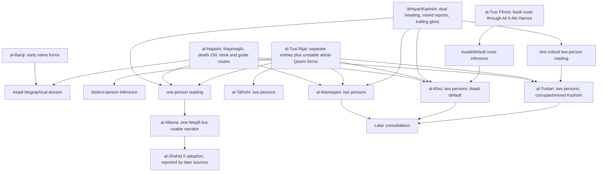

# Case 3 — أبو بصير: a shared kunya, two different questions, and a false scholarly contrast

**Research status:** Phase 1 case study; local corpus and database snapshot checked 24 August 2026.

## Result in brief

Two questions must not be collapsed:

1. **Person-equivalence:** Is Abū Baṣīr al-Asadī, Yaḥyā b. Abī al-Qāsim, the same historical person as Yaḥyā b. al-Qāsim al-Ḥadhdhāʾ al-Azdī?
2. **Occurrence resolution:** Which historical person is meant by an unqualified أبو بصير in a particular chain?

The first question has a strong answer: **they are distinct persons**. The decisive cumulative evidence is al-Ṭūsī's separate entries, especially two separate entries in the companions of al-Kāẓim; al-Asadī's reported death in 150 AH; and al-Ḥadhdhāʾ's Wāqifī/Riḍā-period setting, which presupposes life after al-Kāẓim's death in 183 AH. The labels al-Asadī/Kūfī and al-Azdī/al-Ḥadhdhāʾ support the distinction but are not conclusive alone.

The second question often remains contextual. A bare أبو بصير is normally a candidate for Yaḥyā al-Asadī or Layth al-Murādī, not for al-Ḥadhdhāʾ merely because al-Ḥadhdhāʾ also bore a similar name. Al-Khūʾī argues for a default to Yaḥyā al-Asadī and adds that residual Yaḥyā/Layth uncertainty generally does not change sanad reliability because both are trustworthy. A historical identity engine must nevertheless preserve the unresolved candidate set.

### Correction of the assignment's premise

The requested contrast — “al-Khūʾī says they are distinct; al-Tustarī says they are one” — is not found in al-Tustarī's text. Al-Tustarī says the opposite, twice and emphatically:

> وتوهّم العلّامة في الخلاصة اتّحاد هذا مع يحيى بن القاسم الحذّاء من الكشّي، وتبعه الزين.

— al-Tustarī, *Qāmūs al-rijāl*, vol. 11, p. 17, entry 8302 ([exact page](https://ablibrary.net/book_content/b/13931/17)).

In the appended monograph he is more explicit:

> وأما زعم ابن طاوس والعلامة وابن داود لاتحاد يحيى الحذاء مع أبي بصير ... فخبط واضح.

— al-Tustarī, *al-Durr al-naḍīr fī al-mukannayn bi-Abī Baṣīr*, appended to *Qāmūs al-rijāl*, vol. 12, p. 456 ([exact page](https://ablibrary.net/book_content/b/13932/456)).

The genuine one-person argument belongs above all to al-ʿAllāma al-Ḥillī and was followed by al-Shahīd al-Thānī according to al-Tustarī and al-Māmaqānī. This case therefore compares al-Khūʾī and al-Tustarī as **two distinct-person analyses with different textual reconstructions**, while fully tracing al-ʿAllāma's one-person model.

## 1. Keep the candidate entities separate

| Provisional historical person | Early-source features | Do not infer |
|---|---|---|
| **Yaḥyā b. Abī al-Qāsim Isḥāq, Abū Baṣīr al-Asadī** | blind; mawlā of Banū Asad; Kūfī; companion of al-Bāqir and al-Ṣādiq and reported from al-Kāẓim; called Abū Muḥammad; trustworthy and eminent in al-Najāshī; death 150 AH | that every bare أبو بصير occurrence is his |
| **Yaḥyā b. al-Qāsim al-Ḥadhdhāʾ al-Azdī** | separate al-Ṭūsī and Kashshī headings; Wāqifī; connected with al-Kāẓim/Riḍā-era reports | al-Asadī's tawthīq, blindness, death date, or book routes |
| **Layth b. al-Bakhtarī al-Murādī, Abū Baṣīr** | a second famous Abū Baṣīr; explicitly named in some Four Books chains and praised in the rijāl material | identity with either Yaḥyā |
| **أبو بصير المكفوف** | an occurrence label/property, usually evidence pointing toward the blind Yaḥyā | a fourth person created from the adjective alone |

Other rare men were also called Abū Baṣīr. Al-Khūʾī's general kunya entry lists Yaḥyā, Layth, ʿAbd Allāh b. Muḥammad, Yūsuf b. al-Ḥārith, and Ḥammād b. ʿAbd Allāh; he then argues that actual unqualified Four Books usage is confined in practice to Yaḥyā and Layth. See *Muʿjam rijāl al-ḥadīth*, vol. 22, pp. 49–52, entry 13988 ([p. 49](https://lib.eshia.ir/14036/22/49), [p. 52](https://lib.eshia.ir/14036/22/52)).

## 2. Literal Four Books occurrences

These are literal extracted isnāds, not reconstructed routes. Bracketed footnote markers belong to the digital witness and are not identity annotations added here.

### 2.1 An explicitly named Murādī

*Al-Kāfī*, vol. 2, p. 518, local id **alkafi-3261** ([exact page](https://lib.eshia.ir/11005/2/518)):

> عِدَّةٌ مِنْ أَصْحَابِنَا عَنْ أَحْمَدَ بْنِ مُحَمَّدٍ عَنْ عَمْرِو بْنِ عُثْمَانَ وَعَلِيُّ بْنُ إِبْرَاهِيمَ عَنْ أَبِيهِ جَمِيعاً عَنْ عَبْدِ اللَّهِ بْنِ الْمُغِيرَةِ عَنِ ابْنِ مُسْكَانَ عَنْ أَبِي بَصِيرٍ لَيْثٍ الْمُرَادِيِّ عَنْ عَبْدِ الْكَرِيمِ بْنِ عُتْبَةَ عَنْ أَبِي عَبْدِ اللَّهِ عليه السلام قَالَ

The same report is transmitted in *Tahdhīb al-aḥkām*, vol. 1, p. 39 as:

> ... عَنِ ابْنِ مُسْكَانَ عَنْ لَيْثٍ الْمُرَادِيِّ أَبِي بَصِيرٍ عَنْ عَبْدِ الْكَرِيمِ ...

— local id **tahdhib-106** ([exact page](https://lib.eshia.ir/10083/1/39)); compare *al-Istibṣār*, vol. 1, p. 51, **istibsar-144** ([exact page](https://lib.eshia.ir/11002/1/51)). These are parallel copies of one transmission, not three independent identity witnesses.

### 2.2 An explicitly qualified Asadī

*Al-Kāfī*, vol. 6, p. 71, **alkafi-10656** ([exact page](https://lib.eshia.ir/11005/6/71)):

> أَبُو عَلِيٍّ الْأَشْعَرِيُّ عَنْ مُحَمَّدِ بْنِ عَبْدِ الْجَبَّارِ وَمُحَمَّدُ بْنُ جَعْفَرٍ أَبُو الْعَبَّاسِ الرَّزَّازُ عَنْ أَيُّوبَ بْنِ نُوحٍ جَمِيعاً عَنْ صَفْوَانَ عَنْ مَنْصُورِ بْنِ حَازِمٍ عَنْ أَبِي بَصِيرٍ الْأَسَدِيِّ وَمُحَمَّدِ بْنِ عَلِيٍّ الْحَلَبِيِّ وَعُمَرَ بْنِ حَنْظَلَةَ عَنْ أَبِي عَبْدِ اللَّهِ عليه السلام قَالَ

The parallel appears in *Tahdhīb*, vol. 8, p. 52, **tahdhib-10317** ([exact page](https://lib.eshia.ir/10083/8/52)), and *Istibṣār*, vol. 3, p. 285, **istibsar-4088** ([exact page](https://lib.eshia.ir/11002/3/285)). Again, parallel survival raises confidence in the wording but must not be counted as three independent narrator relationships.

### 2.3 An explicit full identification

*Man lā yaḥḍuruhu al-faqīh*, vol. 4, p. 163, **faqih-5362** ([exact page](https://lib.eshia.ir/11021/4/163)):

> رَوَى عَلِيُّ بْنُ الْحَكَمِ عَنْ أَبَانٍ الْأَحْمَرِ عَنْ أَبِي بَصِيرٍ يَحْيَى بْنِ أَبِي الْقَاسِمِ الْأَسَدِيِّ عَنْ أَبِي جَعْفَرٍ عليه السلام قَالَ

This is a high-quality occurrence-level anchor: kunya, forename, father-name form, and nisba occur together.

A second explicit-name route is *al-Faqīh*, vol. 4, p. 179, **faqih-5398** ([exact page](https://lib.eshia.ir/11021/4/179)):

> وَرَوَى مُحَمَّدُ بْنُ أَبِي عَبْدِ اللَّهِ الْكُوفِيُّ عَنْ مُوسَى بْنِ عِمْرَانَ النَّخَعِيِّ عَنْ عَمِّهِ الْحُسَيْنِ بْنِ يَزِيدَ عَنِ الْحَسَنِ بْنِ عَلِيِّ بْنِ أَبِي حَمْزَةَ عَنْ أَبِيهِ عَنْ يَحْيَى بْنِ أَبِي الْقَاسِمِ عَنِ الصَّادِقِ جَعْفَرِ بْنِ مُحَمَّدٍ ...

It independently connects the Ibn Abī Ḥamza family route with Yaḥyā b. Abī al-Qāsim, but it does not identify every report through that family automatically.

### 2.4 The only Four Books surface form “Yaḥyā al-Ḥadhdhāʾ” in this snapshot

*Al-Kāfī*, vol. 5, p. 318, **alkafi-9379** ([exact page](https://lib.eshia.ir/11005/5/318)):

> عِدَّةٌ مِنْ أَصْحَابِنَا عَنْ سَهْلِ بْنِ زِيَادٍ عَنْ يَعْقُوبَ بْنِ يَزِيدَ عَنْ زَكَرِيَّا الْخَزَّازِ عَنْ يَحْيَى الْحَذَّاءِ قَالَ: قُلْتُ لِأَبِي الْحَسَنِ عليه السلام ...

This is a candidate occurrence for Yaḥyā b. al-Qāsim al-Ḥadhdhāʾ, but the surface form alone does not prove the expansion. “Abū al-Ḥasan” is compatible with an al-Kāẓim setting, and al-Asadī also reportedly narrated from al-Kāẓim before dying in 150 AH. The engine should record the candidate and its contextual support, not silently replace يحيى الحذاء with a full canonical identity.

### 2.5 “The blind” is a property, not a fresh person

*Tahdhīb*, vol. 2, p. 39, **tahdhib-1658** ([exact page](https://lib.eshia.ir/10083/2/39)):

> وَرَوَى الْحُسَيْنُ بْنُ سَعِيدٍ عَنِ النَّضْرِ عَنْ عَاصِمِ بْنِ حُمَيْدٍ عَنْ أَبِي بَصِيرٍ الْمَكْفُوفِ قَالَ

The same literal chain is in *Istibṣār*, vol. 1, p. 276, **istibsar-1000** ([exact page](https://lib.eshia.ir/11002/1/276)). Al-Ṭūsī's rijāl entry expressly describes Yaḥyā b. Abī al-Qāsim as مكفوف, so the adjective strongly favours him. It still belongs in the occurrence record as a descriptive form; it must not become a database person merely because an imported lexicon has an “Abū Baṣīr al-Makfūf” heading.

### 2.6 Bare forms that the chain itself does not resolve

*Al-Kāfī*, vol. 2, p. 362, **alkafi-2776** ([exact page](https://lib.eshia.ir/11005/2/362)):

> عِدَّةٌ مِنْ أَصْحَابِنَا عَنْ أَحْمَدَ بْنِ مُحَمَّدِ بْنِ خَالِدٍ وَأَبُو عَلِيٍّ الْأَشْعَرِيُّ عَنْ مُحَمَّدِ بْنِ حَسَّانَ جَمِيعاً عَنْ إِدْرِيسَ بْنِ الْحَسَنِ عَنْ مُصَبِّحِ بْنِ هِلْقَامٍ قَالَ أَخْبَرَنَا أَبُو بَصِيرٍ قَالَ سَمِعْتُ أَبَا عَبْدِ اللَّهِ عليه السلام يَقُولُ

Other useful bare-form controls are:

- *al-Kāfī*, vol. 2, p. 553, **alkafi-3369**: أبو بصير عن أبي عبد الله عليه السلام قال ([exact page](https://lib.eshia.ir/11005/2/553)). This is a mursal opening with no preceding student.
- *al-Kāfī*, vol. 3, p. 219, **alkafi-4629**: ... عن أبي عبد الرحمن قال حدثنا أبو بصير قال سمعت أبا عبد الله عليه السلام ... ([exact page](https://lib.eshia.ir/11005/3/219)).
- *al-Kāfī*, vol. 4, p. 402, **alkafi-7468**: وروى أبو بصير عن أبي عبد الله عليه السلام قال ([exact page](https://lib.eshia.ir/11005/4/402)).

None can be made explicit by lexically expanding the kunya. They require contextual evidence, and the first and third have relatively uninformative or themselves ambiguous adjacent transmitters.

## 3. Early rijāl and bibliographic sources

### 3.1 Al-Najāshī: a clear al-Asadī biography

Al-Najāshī, *Rijāl al-Najāshī*, p. 441, no. 1187:

> يحيى بن القاسم أبو بصير الأسدي، وقيل: أبو محمد، ثقة، وجيه، روى عن أبي جعفر وأبي عبد الله عليهما السلام، وقيل يحيى بن أبي القاسم، واسم أبي القاسم إسحاق. وروى عن أبي الحسن موسى عليه السلام. له كتاب يوم وليلة ... الحسن بن علي بن أبي حمزة، عن أبي بصير بكتابه. ومات أبو بصير سنة خمسين ومائة.

([Exact page](https://lib.eshia.ir/14028/1/441).)

This entry supplies four distinct claim types:

- **name variants:** يحيى بن القاسم / يحيى بن أبي القاسم, with the explanation that Abū al-Qāsim's personal name was Isḥāq;
- **evaluation:** ثقة، وجيه;
- **teacher and source-book claims:** transmission from al-Bāqir, al-Ṣādiq, and al-Kāẓim; a *Yawm wa-layla* book;
- **chronology:** death in 150 AH.

The digital edition is *Rijāl al-Najāshī*, critical work supervised by Mūsā al-Shubayrī al-Zanjānī, Muʾassasat al-Nashr al-Islāmī. The online preface is dated 8 Rabīʿ I 1407 AH; the retrieved viewer does not expose a formal edition number or printing year, so those are not asserted here.

Al-Najāshī's related entries make the book-route evidence more concrete:

- ʿAlī b. Abī Ḥamza was “قائد أبي بصير يحيى بن القاسم” (*Rijāl al-Najāshī*, p. 249, no. 656, [exact page](https://lib.eshia.ir/14028/1/249)).
- al-Ḥasan b. ʿAlī b. Abī Ḥamza's father was Abū Baṣīr's guide and later a leading Wāqifī (*ibid.*, p. 36, no. 73, [exact page](https://lib.eshia.ir/14028/1/36)).
- ʿAbd Allāh b. Waḍḍāḥ “صاحب أبا بصير يحيى بن القاسم كثيرا وعرف به” (*ibid.*, p. 215, no. 560, [exact page](https://lib.eshia.ir/14028/1/215)).

These dependencies matter: later identification from an ʿAlī b. Abī Ḥamza route ultimately leans on this named guide relationship and explicit parallel chains; it is not an independent tawthīq.

### 3.2 Al-Ṭūsī's *Rijāl*: the main source of both distinction and confusion

Edition used: al-Ṭūsī, *al-Rijāl*, ed. Jawād al-Qayyūmī al-Iṣfahānī, Muʾassasat al-Nashr al-Islāmī/Jamāʿat al-Mudarrisīn, Qum, 3rd ed., 1373 Sh ([edition page](https://lib.eshia.ir/12146/1/1)).

In the companions of al-Bāqir, p. 149:

> 1650- 2 يحيى بن أبي القاسم، يكنى أبا بصير، مكفوف، واسم أبي القاسم إسحاق.
>
> 1651- 3 يحيى بن القاسم الحذاء.

([Exact page](https://lib.eshia.ir/12146/1/149).) The apparatus records أبي القاسم as a variant in the second entry. Numbering differs in some electronic imports; 1650 and 1651 are the printed numbers in this edition.

In the companions of al-Ṣādiq, p. 321:

> 4792- 9 يحيى بن القاسم، أبو محمد، يعرف بأبي بصير الأسدي، مولاهم كوفي، تابعي، مات سنة خمسين ومائة بعد أبي عبد الله عليه السلام.

([Exact page](https://lib.eshia.ir/12146/1/321).)

In the companions of al-Kāẓim, p. 346:

> 5172- 16 يحيى بن القاسم الحذاء، واقفي.
>
> 5173- 17 يوسف بن يعقوب، واقفي.
>
> 5174- 18 يحيى بن أبي القاسم، يكنى أبا بصير.

([Exact page](https://lib.eshia.ir/12146/1/346).)

The al-Kāẓim list is especially probative: al-Ḥadhdhāʾ and Abū Baṣīr are not merely written in two adjacent variants; Yūsuf b. Yaʿqūb intervenes. A one-person reading must explain why al-Ṭūsī entered the same man twice in one companion-list under differentiated forms.

At the same time, al-Ṭūsī creates the later problem:

- he writes the Asadī as يحيى بن القاسم in the al-Ṣādiq section, omitting أبي;
- the al-Bāqir apparatus supplies a possible أبي to the Ḥadhdhāʾ entry;
- the two men share forename and a near-identical patronymic;
- he assigns al-Ḥadhdhāʾ to al-Bāqir in one place while the Wāqifī label points to a much later life.

The engine must represent these as source-level variants and potentially erroneous classifications. It must not normalize away أبي before evaluating identity, and it must not silently “correct” either entry.

### 3.3 Al-Ṭūsī's *Fihrist*: a bibliographic route, not a second biography

Al-Ṭūsī, *al-Fihrist*, ed. Jawād al-Qayyūmī, Nashr al-Fiqāha, printed by Muʾassasat al-Nashr al-Islāmī, 1st ed., Shaʿbān 1417 AH ([edition page](https://lib.eshia.ir/14010/1/1)), p. 262, printed no. 798:

> يحيى بن القاسم، يكنى أبا بصير. له كتاب مناسك الحج، رواه علي بن أبي حمزة والحسين بن أبي العلاء، عنه.

([Exact page](https://lib.eshia.ir/14010/1/262).)

Some numbering systems call this no. 797. The unqualified form يحيى بن القاسم superficially resembles al-Ḥadhdhāʾ, but the kunya and ʿAlī b. Abī Ḥamza book-route align it with al-Asadī. This is one bibliographic witness with a transmission route; it is not independent evidence that the two biographical persons are one.

### 3.4 Al-Barqī: valuable but visibly unstable text

In the companions of al-Bāqir, *Rijāl al-Barqī*, p. 11:

> أبو بصير يحيى بن أبي القاسم الأسدي، واسم أبي القاسم يحيى بن القاسم.

([Exact page](https://lib.eshia.ir/86758/1/11).)

The last clause is textually incoherent as it stands: it appears to make the name of Abū al-Qāsim “Yaḥyā b. al-Qāsim,” whereas al-Najāshī and al-Ṭūsī say it was Isḥāq. It is evidence for textual corruption, not permission to choose an emendation silently.

In the companions of al-Ṣādiq, p. 17:

> أبو بصير الأسدي يحيى بن [أبي] القاسم، وكان أبو عبد الله عليه السلام يكنّي بأبي بصير أبا محمد.

([Exact page](https://lib.eshia.ir/86758/1/17).) The square-bracketed أبي is editorial in this digital witness. The eShia viewer does not expose adequate colophon metadata on its first page, so this study cites the exact digital page but does not pretend that a manuscript-level edition verification has been made.

### 3.5 The extant Kashshī material: two headings, mixed reports, and a dangerous gloss

The extant source is al-Ṭūsī's *Ikhtiyār maʿrifat al-rijāl*, not an untouched copy of al-Kashshī's lost original. Edition used: ed. Ḥasan al-Muṣṭafawī, Muʾassasat-i Nashr-i Dānishgāh-i Mashhad, Mashhad, 1st ed., 1409 AH ([edition page](https://lib.eshia.ir/10241/1/1)). Modern section headings and footnotes must be distinguished from report text.

Under the heading “في أبي بصير ليث بن البختري المرادي” ([p. 169](https://lib.eshia.ir/10241/1/169)), reports about Layth and Yaḥyā are visibly mixed. Among them:

- report 291 states: “قلت لأبي عبد الله عليه السلام ... فممن نسأل؟ قال: عليك بالأسدي، يعني أبا بصير” ([p. 171](https://lib.eshia.ir/10241/1/171));
- report 296 transmits Ibn Faḍḍāl's identification:

> سألت علي بن الحسن بن فضال عن أبي بصير ... اسمه يحيى بن أبي القاسم ... كان يكنى أبا محمد، وكان مولى لبني أسد، وكان مكفوفا ... أما الغلو فلا ... ولكن كان مخلطا.

([P. 173](https://lib.eshia.ir/10241/1/173).)

Far later comes the explicit dual heading:

> في يحيى بن أبي القاسم أبي بصير ويحيى بن القاسم الحذاء

— p. 474 ([exact page](https://lib.eshia.ir/10241/1/474)). Report 901 begins:

> حمدويه، ذكره عن بعض أشياخه: يحيى بن القاسم الحذاء الأزدي واقفي.

The conjunction in the heading naturally reads as two persons: Yaḥyā b. Abī al-Qāsim Abū Baṣīr **and** Yaḥyā b. al-Qāsim al-Ḥadhdhāʾ. Report 902 then uses “أبو بصير ابن أبي القاسم” ([p. 475](https://lib.eshia.ir/10241/1/475)).

Report 903 is the crux. It has an internally unstable family narrative: the isnād names “علي بن محمد بن القاسم الحذاء الكوفي,” while the speaker inside the report is “أنا محمد بن علي بن القاسم الحذاء.” The Imam is made to say:

> أما إن عمك كان ملتويا على الرضا ... إن كان رجع فلا بأس.

It is followed by:

> واسم عمه القاسم الحذاء. وأبو بصير هذا يحيى بن القاسم يكنى أبا محمد.

— pp. 475–76 ([exact p. 476](https://lib.eshia.ir/10241/1/476)).

The dislocation, the narrator-name inversion, and recorded variants make this poor material for an irreversible merge. The one-person line treats the trailing هذا sentence as a direct identification of Abū Baṣīr with al-Ḥadhdhāʾ. Al-Tustarī instead treats the section as corrupted or glossed and reconstructs the reports under two men. Without manuscript collation, the system should store the transmitted text, the variant readings, and both scholarly interpretations separately.

### 3.6 Al-Ṣadūq's Mashyakha: route evidence with an editorial trap

Al-Ṣadūq says:

> وما كان فيه عن أبي بصير فقد رويته عن محمد بن علي ماجيلويه ... عن محمد بن أبي عمير عن علي بن أبي حمزة عن أبي بصير.

— *Mashyakhat Man lā yaḥḍuruhu al-faqīh*, vol. 4, pp. 431–32 ([p. 431](https://lib.eshia.ir/11021/4/431), [p. 432](https://lib.eshia.ir/11021/4/432)).

Together with al-Najāshī's statement that ʿAlī b. Abī Ḥamza guided Yaḥyā, and with explicitly expanded parallels, this supports al-Khūʾī's identification of al-Ṣadūq's default Abū Baṣīr route with Yaḥyā al-Asadī. The note on p. 432 that calls him “المرمي بالوقف” is a modern editorial footnote, not al-Ṣadūq's wording. It must not be ingested as a primary rijāl claim.

## 4. How the scholarly dispute developed

### 4.1 Al-ʿAllāma al-Ḥillī: the historical one-person model

Al-ʿAllāma's *Khulāṣat al-aqwāl* places the materials in one entry:

> يحيى بن القاسم الحذاء ... من أصحاب الكاظم عليه السلام، وكان يكنى أبا بصير ... وقيل: إنه أبو محمد.

He then imports al-Najāshī's Asadī tawthīq, book, and death date into the same dossier and concludes:

> والذي أراه العمل بروايته، وإن كان مذهبه فاسدا.

— al-ʿAllāma al-Ḥillī, *Khulāṣat al-aqwāl*, ed. Jawād al-Qayyūmī, Nashr al-Fiqāha, printed by Muʾassasat al-Nashr al-Islāmī, 1st ed., ʿĪd al-Ghadīr 1417 AH, printed pp. 416–17. The accessible link is a continuous transcription preserving printed page markers rather than a scan: [entry at pp. 416–17](https://akhbariyyah.net/ar/2021/07/26/khulasat-ul-aqwal-lil-hilli/).

His construction can be reconstructed without attributing motives to him:

1. treat يحيى بن القاسم and يحيى بن أبي القاسم as variants of one patronymic;
2. take the Kashshī trailing sentence “وأبو بصير هذا يحيى بن القاسم” as an equation;
3. combine al-Ṭūsī's واقفي for al-Ḥadhdhāʾ with al-Najāshī's ثقة، وجيه for al-Asadī;
4. retain the combined verdict: doctrinally Wāqifī, narratively usable.

This explains the otherwise surprising ending “وإن كان مذهبه فاسدا.” It does not resolve the death-150/post-183 chronological contradiction; it simply places both claims in one entry. The modern footnotes attached to the online edition challenge the union, but they are not al-ʿAllāma's text.

Al-Tustarī says al-Shahīd al-Thānī (“al-Zayn”) followed al-ʿAllāma (*Qāmūs*, vol. 11, p. 17). Al-Māmaqānī likewise treats al-Shahīd's position as derivative. A direct primary passage from al-Shahīd al-Thānī has not been located in this research cycle, so the dependency is reported as al-Tustarī's and al-Māmaqānī's testimony, not as an independently verified quotation.

### 4.2 Al-Tafrīshī: an early explicit rejection

After quoting al-ʿAllāma, al-Tafrīshī observes:

> ويظهر من رجال الشيخ عند ذكر أصحاب الكاظم عليه السلام ومن الكشي أن يحيى بن القاسم الحذاء ويحيى بن أبي القاسم رجلان حيث ذكراهما ونسبا يحيى بن القاسم الحذاء إلى الوقف لا يحيى بن أبي القاسم أبا بصير الأسدي.

— Muṣṭafā al-Tafrīshī, *Naqd al-rijāl*, vol. 5, p. 82 in the ABL digital pagination ([exact page](https://ablibrary.net/book_content/3778/82)).

His contribution is a source-structure inference: the Wāqifī predicate attaches to the separately headed al-Ḥadhdhāʾ, not to al-Asadī. It is not a second early testimony about either man's character.

### 4.3 Al-Māmaqānī: two men, argued cumulatively

In the old edition of *Tanqīḥ al-maqāl*, entry 12975, al-Māmaqānī's categorical finding is:

> والذي يقتضيه التحقيق ويرتضيه النظر الدقيق أن لنا رجلين: أحدهما يحيى بن أبي القاسم إسحاق الأسدي المكنى بأبي بصير وأبي محمد، وهو إمامي ثقة عدل ... والآخر يحيى بن القاسم الحذاء الأزدي ... كان واقفا ... ولم يرد فيه توثيق ولا مدح.

— ʿAbd Allāh al-Māmaqānī, *Tanqīḥ al-maqāl* (old edition), printed p. 309, ABL digital p. 215 ([exact digital page](https://ablibrary.net/book_content/b/18294/215)). The surrounding discussion begins at printed p. 308 ([digital p. 214](https://ablibrary.net/book_content/b/18294/214)) and continues through printed pp. 310–11 ([digital p. 216](https://ablibrary.net/book_content/b/18294/216), [digital p. 217](https://ablibrary.net/book_content/b/18294/217)). The legacy viewer may redirect from book id 18532 to canonical book id 18294; no more precise colophon data is exposed there.

His evidence is cumulative:

1. the Kashshī heading names two men and contrasts Abū Baṣīr al-Asadī with al-Ḥadhdhāʾ al-Azdī;
2. al-Ṭūsī lists two entries consecutively under al-Bāqir, then differentiates them again under al-Ṣādiq and al-Kāẓim;
3. the separate headings used by Ibn Ṭāwūs and the ordering attributed to ʿInāyat Allāh also presuppose two dossiers, even where report assignment is confused;
4. al-Najāshī gives the Asadī a tawthīq and death date without mentioning Waqf;
5. a man who died in 150 AH cannot have adopted the Wāqifī position that arose after al-Kāẓim's death in 183 AH;
6. the Asadī/Azdī and al-Ḥadhdhāʾ labels reinforce the separation.

His chronological conclusion is blunt:

> فلا بد أن يكون الواقفي يحيى آخر غير أبي بصير وليس إلا الحذاء فهما رجلان لا واحد.

— printed p. 310, [digital p. 216](https://ablibrary.net/book_content/b/18294/216).

On printed p. 311 he places al-Tafrīshī, the author of *Takmilat al-rijāl*, al-Khurāsānī, and al-Waḥīd in the distinct-person line; criticises al-ʿAllāma's conflation; says al-Shahīd al-Thānī followed it; and notes still other over-splitting schemes. Those are al-Māmaqānī's historiographic reports. They should not be counted as independent conclusions until the cited works themselves are checked.

The request asks for al-Māmaqānī's “حصيلة البحث.” In this old edition there is no separate heading with that formula. The quoted “والذي يقتضيه التحقيق...” paragraph is the author's actual result; inventing a heading would falsify the source.

### 4.4 Al-Tustarī: distinction through textual criticism

Edition used: Muḥammad Taqī al-Tustarī, *Qāmūs al-rijāl*, critical work by Muʾassasat al-Nashr al-Islāmī, published by Jamāʿat al-Mudarrisīn, Qum. The ABL viewer does not expose a printing year or edition number, so none is asserted.

Al-Tustarī assembles the Abū Baṣīr dossier at entry 8302, vol. 11, pp. 14–23:

- [p. 14](https://ablibrary.net/book_content/b/13931/14): al-Ṭūsī's al-Bāqir entry;
- [p. 15](https://ablibrary.net/book_content/b/13931/15): the al-Ṣādiq and al-Kāẓim entries, *Fihrist*, al-Najāshī, and Kashshī materials;
- [p. 16](https://ablibrary.net/book_content/b/13931/16): the uncle/nephew report and its unstable wording;
- pp. 17–23: adjudication and reassignment of mixed reports, beginning at [p. 17](https://ablibrary.net/book_content/b/13931/17); exact pages for the central steps are linked below.

His reasoning is not merely chronological:

1. **Blindness fixes certain occurrences.** Because the early entries explicitly call Yaḥyā b. Abī al-Qāsim blind, chains saying أبو بصير المكفوف concern him. At p. 17 he immediately adds that al-ʿAllāma wrongly united this person with al-Ḥadhdhāʾ.
2. **The Kashshī heading grammatically names two persons.** At p. 21 ([exact page](https://ablibrary.net/book_content/b/13931/21)) he argues that the heading and distribution make no coherent sense if both names are one man.
3. **The extant Kashshī section is mixed or corrupt.** He treats the trailing “وأبو بصير هذا...” and the uncle-name material as displaced annotation rather than a secure equation. His reconstruction is an editorial hypothesis and must be stored as such, but it explains why Yaḥyā reports occur under Layth and why al-Ḥadhdhāʾ material is attached to Abū Baṣīr.
4. **The Waqf claim cannot attach to the man who died in 150.** At p. 22 ([exact page](https://ablibrary.net/book_content/b/13931/22)) he rejects using Wāqifī-origin material to turn the earlier Abū Baṣīr into a Wāqifī.
5. **Al-Ṭūsī himself may have been misled by the mixed Kashshī text.** In a separate al-Ḥadhdhāʾ entry, no. 8303, pp. 24–25, he argues that the أبي variant and assignment to al-Bāqir are errors:

> ولا يصح عد الحذاء ... إلا باتحاده مع يحيى أبي بصير، كما توهمه الخلاصة، ولعل الشيخ في الرجال أيضا توهمه من الكشي...

— [p. 25](https://ablibrary.net/book_content/b/13931/25); see the distinct heading at [p. 24](https://ablibrary.net/book_content/b/13931/24).

His appended *al-Durr al-naḍīr fī al-mukannayn bi-Abī Baṣīr* reinforces rather than reverses this conclusion. It calls the Ibn Ṭāwūs/al-ʿAllāma/Ibn Dāwūd union “فخبط واضح” ([vol. 12, p. 456](https://ablibrary.net/book_content/b/13932/456)), reconstructs the suspected gloss ([p. 459](https://ablibrary.net/book_content/b/13932/459)), discusses the father-name variants ([p. 460](https://ablibrary.net/book_content/b/13932/460), [p. 461](https://ablibrary.net/book_content/b/13932/461), [p. 462](https://ablibrary.net/book_content/b/13932/462)), and argues that a bare Abū Baṣīr normally means Yaḥyā rather than Layth ([p. 448](https://ablibrary.net/book_content/b/13932/448)).

Al-Tustarī and al-Khūʾī therefore agree on the entity-level distinction and on a broad Yaḥyā default. They differ in method: al-Tustarī makes more aggressive source-critical reassignments and emendations within the Kashshī dossier, while al-Khūʾī grades the transmitted reports and uses route/occurrence comparisons without needing every textual reconstruction.

### 4.5 Al-Khūʾī: distinction, default identity, and reliability are three separate arguments

Al-Khūʾī's main biography is *Muʿjam rijāl al-ḥadīth*, vol. 21, pp. 79–90, entry 13599 ([p. 79](https://lib.eshia.ir/14036/21/79)). His analysis has four layers.

#### A. Name and default-kunya identification

At pp. 80–81 he reconciles يحيى بن القاسم and يحيى بن أبي القاسم through al-Najāshī's explanation that Abū al-Qāsim was Isḥāq. He then argues that an unqualified Abū Baṣīr normally means Yaḥyā al-Asadī:

1. al-Ṭūsī explicitly says Yaḥyā “يعرف بأبي بصير الأسدي”;
2. Ibn Faḍḍāl, asked for Abū Baṣīr's name, answers “يحيى بن أبي القاسم”;
3. al-Ṣadūq's Mashyakha route passes through ʿAlī b. Abī Ḥamza, known from al-Najāshī as Yaḥyā's guide, and the *Faqīh* occurrence/parallel pattern confirms that route. Al-Khūʾī says al-Ṣadūq begins a sanad with the unnamed Abū Baṣīr in “ما يقرب من ثمانين موردا,” while this route's transmitter from him is ʿAlī b. Abī Ḥamza ([vol. 21, p. 81](https://lib.eshia.ir/14036/21/81)).

This is a dependency chain, not three independent early testimonies: the Mashyakha inference depends partly on al-Najāshī's guide statement and on corpus parallels.

#### B. Categorical separation from al-Ḥadhdhāʾ

Al-Khūʾī states:

> الثالثة: أن أبا بصير الأسدي مغاير ليحيى بن القاسم الحذاء الآتي جزما، لأن الثاني واقفي وقد بقي إلى زمان الرضا عليه السلام ... وأبو بصير مات سنة مائة وخمسين.

— vol. 21, p. 81 ([exact page](https://lib.eshia.ir/14036/21/81)).

This is a chronology argument with two source premises: al-Asadī's death in 150 from al-Najāshī/al-Ṭūsī, and al-Ḥadhdhāʾ's Wāqifī/Riḍā-period evidence from al-Ṭūsī/Kashshī/al-ʿAyyāshī. If either premise were rejected, “جزما” would no longer follow; both are well-supported enough for his conclusion.

His separate al-Ḥadhdhāʾ entry, no. 13600, quotes al-Ṭūsī's:

> يحيى بن القاسم الحذاء، واقفي.

and the Kashshī nephew report, then cites the al-ʿAyyāshī report in which Abū al-Ḥasan asks whether Yaḥyā b. al-Qāsim al-Ḥadhdhāʾ has died and describes a “مستودع” whose faith is later removed. See vol. 21, pp. 90–91 ([p. 90](https://lib.eshia.ir/14036/21/90), [p. 91](https://lib.eshia.ir/14036/21/91)). The Riḍā-era inference is partly contextual; an exact death date for al-Ḥadhdhāʾ is not known.

#### C. Reliability of al-Asadī

At pp. 82–89 al-Khūʾī:

- treats the predominant interpretation of the Aṣḥāb al-Ijmāʿ notice as including Yaḥyā al-Asadī;
- accepts the report “عليك بالأسدي” as sound praise;
- examines rather than merely counts the blame reports;
- concludes that no sound report establishes the alleged blame;
- says Ibn Faḍḍāl's “مخلط” does not contradict tawthīq.

His conclusion is:

> فلا ينبغي الشك في وثاقة أبي بصير يحيى بن أبي القاسم، سواء أكان من أصحاب الإجماع أم لم يكن.

— vol. 21, p. 89 ([exact page](https://lib.eshia.ir/14036/21/89)).

This tawthīq must attach to al-Asadī even if an occurrence remains unresolved between him and Layth. It must not transfer to al-Ḥadhdhāʾ through name similarity.

#### D. Practical effect of a bare Abū Baṣīr

Al-Khūʾī's general entry counts 2,275 occurrences in his surveyed corpus and devotes pp. 52–65 to explicit names and cross-book/script variants. He concludes:

> ذكر بعضهم أن أبا بصير مشترك بين الثقة وغيره ... ولكنا ... عند ما أطلق فالمراد ... يحيى بن أبي القاسم، وعلى تقدير الإغماض فالأمر يتردد بينه وبين ليث ... الثقة، فلا أثر للتردد، وأما غيرهما فليس بمعروف بهذه الكنية، بل لم يوجد مورد يطلق فيه أبو بصير ويراد به غير هذين.

— *Muʿjam*, vol. 22, p. 52, entry 13988 ([exact page](https://lib.eshia.ir/14036/22/52)); full catalogue [pp. 49–65](https://lib.eshia.ir/14036/22/49). Separate derivative headings are “Abū Baṣīr al-Asadī,” entry 13990, [p. 66](https://lib.eshia.ir/14036/22/66), and “Abū Baṣīr al-Murādī,” entry 13991, [pp. 66–67](https://lib.eshia.ir/14036/22/66).

“No effect” is a sanad-reliability conclusion under al-Khūʾī's premises, not an identity conclusion. A prosopographical database still needs to retain Yaḥyā/Layth uncertainty.

At vol. 21, p. 90 al-Khūʾī also proposes that al-Najāshī's book route has lost “عن أبيه” between al-Ḥasan b. ʿAlī b. Abī Ḥamza and Abū Baṣīr. That is a corrected-route claim, not license to overwrite the literal route ([exact page](https://lib.eshia.ir/14036/21/90)).

### 4.6 Later consolidation

Jaʿfar al-Subḥānī revisits the issue in *Rasāʾil wa-maqālāt*, vol. 2, pp. 221–27. He states “ولكن الحق تعددهما” ([p. 222](https://ablibrary.net/book_content/b/9265/222)) and adduces:

- the two-name Kashshī heading;
- al-Ṭūsī's al-Kāẓim list, where Yūsuf b. Yaʿqūb separates the two entries;
- the 150/183 chronological problem;
- al-Najāshī's silence about Waqf in the trustworthy Asadī biography;
- teacher/student and guide relationships for distinguishing Yaḥyā from Layth.

See [p. 221](https://ablibrary.net/book_content/b/9265/221), [p. 223](https://ablibrary.net/book_content/b/9265/223), and the transmitter discussion at [p. 225](https://ablibrary.net/book_content/b/9265/225), [p. 226](https://ablibrary.net/book_content/b/9265/226), and [p. 227](https://ablibrary.net/book_content/b/9265/227). He expressly draws on al-Kalbāsī's *Samāʾ al-maqāl*, vol. 1, pp. 317–30; this study did not complete a line-by-line collation of that source, so al-Kalbāsī is recorded as a dependency rather than another verified vote.

## 5. Evidence-dependency graph

### What is and is not independent

| Later proposition | Direct inputs | Dependency assessment |
|---|---|---|
| al-Asadī is ثقة، وجيه and died in 150 | al-Najāshī; al-Ṭūsī independently repeats the death date but not the full evaluation | later repetition of al-Najāshī is one evaluation lineage |
| al-Ḥadhdhāʾ is Wāqifī | al-Ṭūsī's companion list; a weakly mediated Kashshī notice; later al-ʿAyyāshī material | more than one textual route, but not three clean independent eyewitnesses |
| the two are one | synthesis of al-Ṭūsī name variants, Kashshī trailing gloss, and al-Najāshī biography | al-ʿAllāma's inference, not an early explicit person-equivalence claim |
| the two are distinct | al-Ṭūsī's double al-Kāẓim entries; chronology built from death/Waqf-era sources; dual Kashshī heading | convergent structural inferences; al-Tafrīshī, al-Māmaqānī, al-Tustarī, al-Khūʾī are not four new biographical witnesses |
| a Faqīh bare Abū Baṣīr is usually Yaḥyā | al-Ṣadūq route + al-Najāshī guide relation + explicit/parallel occurrences | derived source-route/corpus inference; not a literal expansion by al-Ṣadūq |
| every bare Abū Baṣīr is Yaḥyā | no early source says this | stronger than the evidence; al-Khūʾī's practical fallback still allows Layth |

## 6. What the local corpus actually shows

### 6.1 Search method and frequency

The read-only snapshot was queried in the Four Books' hadith-level isnād fields, not by looking only for the nominative spelling. Normalisation removed vocalisation and taṭwīl and folded initial hamza forms and Persian/Arabic yāʾ. Both oblique **ابي بصير** and nominative **ابو بصير** were counted. Multiple tokens can occur in one row.

| Book | Distinct hadith rows containing either form | ابي بصير tokens | ابو بصير tokens | Total tokens |
|---|---:|---:|---:|---:|
| *al-Kāfī* | 829 | 824 | 6 | 830 |
| *Man lā yaḥḍuruhu al-faqīh* | 190 | 135 | 55 | 190 |
| *Tahdhīb al-aḥkām* | 792 | 791 | 5 | 796 |
| *al-Istibṣār* | 357 | 358 | 1 | 359 |
| **Total** | **2,168** | **2,108** | **67** | **2,175** |

The local full-text corpus, which includes sources beyond these Four Books isnād fields, has 3,871 raw ابي بصير strings and 70 ابو بصير strings. Those totals answer a different query and must not be compared as if they were a canonical bibliography. Al-Khūʾī's published count of 2,275 occurrences likewise reflects his edition, inclusion rules, and method.

A conservative lexical classification of the 2,168 Four Books rows gives:

| Literal class | Rows |
|---|---:|
| bare or otherwise not explicitly resolved in the string | 2,157 |
| explicitly Murādī in the same Abū Baṣīr string | 5 |
| explicitly Asadī or full Yaḥyā identification | 4 |
| explicitly مكفوف | 2 |

This striking imbalance is the practical problem: early biographies can establish that two people are distinct while the overwhelming majority of hadith occurrences still lack a full name.

These are database-snapshot counts, not a critical-edition concordance. Extraction boundaries, taʿlīq, multiple routes in one printed report, and tokenisation can change them. Their use here is structural, not dispositive.

### 6.2 Adjacent-transmitter patterns

For bare/other Abū Baṣīr nodes, a preliminary deduplicated observation count of the immediately preceding transmitter produced these leading surface forms:

| Preceding transmitter surface/canonical label | Observations |
|---|---:|
| ʿAlī b. Abī Ḥamza | 308 |
| Ibn Muskān | 205 |
| Samāʿa | 157 |
| Shuʿayb | 76 |
| ʿĀṣim b. Ḥumayd | 71 |
| Ḥarīz | 65 |
| generic ʿAlī | 63 |
| Isḥāq b. ʿAmmār | 58 |
| Hishām b. Sālim | 54 |
| Wuhayb b. Ḥafṣ | 49 |
| ʿAbd Allāh b. Muskān | 47 |
| Abān b. ʿUthmān | 41 |
| ʿAlī b. Riʾāb | 40 |

These counts are deliberately labelled observations:

- parser aliases split Ibn Muskān from ʿAbd Allāh b. Muskān and can split or merge other surfaces;
- multi-route reports and Four Books parallels can repeat one historical transmission;
- a common student may transmit from both Yaḥyā and Layth;
- “preceding node” can be corrupted, omitted, or a collective route.

The ʿAlī b. Abī Ḥamza concentration is strong support for Yaḥyā al-Asadī because al-Najāshī explicitly calls him Yaḥyā's guide and the *Faqīh* Mashyakha uses this route. It is not an exclusive rule. A resolver may create a **probabilistic identity claim with a traceable reason**; it may not convert all 308 observations into literal full names.

A separate query for chains explicitly naming Layth al-Murādī found 58 Four Books chains, many of which use Layth's name without the kunya. Their recurrent students include Ibn Muskān/ʿAbd Allāh b. Muskān and al-Mufaḍḍal b. Ṣāliḥ. The fact that Ibn Muskān appears in the explicit Murādī anchor above and is also common before bare Abū Baṣīr proves why a one-edge exclusivity rule fails.

The four explicit Asadī/Yaḥyā-with-kunya rows are even less suitable for raw frequency inference: three are the same report copied across *al-Kāfī*, *Tahdhīb*, and *Istibṣār*, while the fourth is the *Faqīh* full-name chain. Independent-lineage deduplication must precede any frequency claim.

### 6.3 Teacher, generation, chronology, and geography

**Teachers.** Both Yaḥyā al-Asadī and Layth al-Murādī report from al-Bāqir and al-Ṣādiq. Yaḥyā al-Asadī also reached al-Kāẓim. Therefore a chain ending at Abū ʿAbd Allāh or Abū Jaʿfar generally cannot distinguish the two famous Abū Baṣīrs. “Abū al-Ḥasan” can narrow a report toward a narrator who lived into al-Kāẓim's imamate, but it does not by itself distinguish early al-Asadī from later al-Ḥadhdhāʾ.

**Generation.** Al-Asadī's death in 150 and al-Ḥadhdhāʾ's post-183 Wāqifī setting are strong negative chronological evidence against union. This is far stronger than the positive fact that both can be placed in broad companion lists.

**Geography and affiliation.** Al-Ṭūsī calls al-Asadī a Kūfī and a mawlā of Banū Asad; Kashshī material calls al-Ḥadhdhāʾ Azdī, while his family material is also situated in a Kūfan/Iraqi network and describes travel between Medina and Iraq. Asadī versus Azdī is useful when explicit, but walāʾ and tribal nisba are not always mutually exclusive categories. Shared Kūfan geography does little to resolve a bare occurrence.

**Source-book transmission.** ʿAlī b. Abī Ḥamza and al-Ḥusayn b. Abī al-ʿAlā transmit Yaḥyā's pilgrimage book in al-Ṭūsī's *Fihrist*; the Ibn Abī Ḥamza family transmits al-Najāshī's *Yawm wa-layla* route. Source ownership plus a named transmitter is stronger than bare adjacency because it identifies a stable book route. Even then, the literal and expanded routes must remain separate.

### 6.4 Parallel-chain evidence

Parallel chains do three useful things in this case:

1. preserve an explicit Layth identification across *al-Kāfī*, *Tahdhīb*, and *Istibṣār*;
2. preserve an explicit al-Asadī qualification across the same three books;
3. expose places where one witness has the kunya and another has the personal name.

They do **not** create an identity where every witness is bare, and they are one transmission lineage when the matn and route are the same. The appropriate derived record is “parallel wording supports this name expansion,” with all witnesses linked beneath it.

## 7. Current database failure modes found in this case

The present local database usefully preserves raw chains, but its imported person layer shows why entry titles cannot be treated as historical people. Relevant rows include:

| Person id | Current canonical label |
|---:|---|
| 13394 | يحيى بن إسحاق أبو بصير |
| 13385 | يحيى بن أبي القاسم |
| 13510 | يحيى بن القاسم |
| 13511 | يحيى بن القاسم الحذاء |
| 13386 | يحيى بن أبي القاسم الحذاء |
| 13898, 13899 | أبو بصير |
| 13900 | أبو بصير الأسدي |
| 13901 | أبو بصير المرادي |
| 13902 | أبو بصير المكفوف |

Some of these are genuine alternative candidates; others are Muʿjam entry headings, aliases, or properties reified as persons. The relation layer correctly links ids 13386 and 13511 as the same al-Ḥadhdhāʾ variant, but it does not yet consolidate the al-Asadī proxies or make occurrence uncertainty intelligible.

In the audited snapshot:

- 2,378 chain-node rows matched Abū Baṣīr surfaces;
- the associated candidate/result records contained 9,082 “ambiguous,” 45 “resolved,” and 29 “unresolved” records because multiple candidates can attach to one node;
- 2,267 nodes received the same four candidates, commonly ranking id 13394 first, then generic al-Asadī, Murādī, and “al-Makfūf”;
- the shared form أبو بصير was attached with the same small shared-count feature to six entries;
- 41 nodes were resolved to the reified “al-Makfūf” heading;
- isolated collective-context resolutions even mapped an Abū Baṣīr node to Zurāra or al-Muʿallā al-Tanafīsī.

These are audit findings about this snapshot, not claims about intentional project design. They expose nine general failure modes:

1. **Global alias collapse:** merging every أبو بصير transfers ثقة from Yaḥyā/Layth and واقفي from al-Ḥadhdhāʾ to one fictitious person.
2. **Lexicon-heading reification:** “Abū Baṣīr al-Asadī,” “al-Murādī,” and “al-Makfūf” become people instead of name forms or candidate constraints.
3. **Destructive normalisation:** deleting أبي turns a meaningful but unstable patronymic distinction into an automatic match.
4. **Property-as-identity:** المكفوف becomes a new entity rather than supporting evidence for the explicitly blind Yaḥyā.
5. **Grammar-blind search:** nominative-only أبو بصير misses the dominant oblique أبي بصير and badly distorts book comparisons.
6. **Parallel inflation:** one report in three Four Books is counted as three independent student relationships.
7. **Exclusive-neighbour rules:** Ibn Muskān or another common transmitter is assumed to narrate from only one Abū Baṣīr despite explicit counterexamples.
8. **Predicate leakage:** reliability, sect, identity, and textual-emendation claims are collapsed into one “status.”
9. **Forced resolution:** a rank-one candidate is persisted as fact when the honest output is a candidate set or tawaqquf.

## 8. Adjudication

### 8.1 Person-equivalence claim

**Adjudication:** Yaḥyā b. Abī al-Qāsim Isḥāq, Abū Baṣīr al-Asadī, and Yaḥyā b. al-Qāsim al-Ḥadhdhāʾ al-Azdī should be represented as **two historical persons**. The conclusion is **muṭmaʾann bihi / strongly established**, without claiming manuscript-level certainty about every corrupt Kashshī phrase.

Evidence in descending force:

1. **Chronological incompatibility:** death 150 versus participation in the post-183 Wāqifī/Riḍā-era setting.
2. **Same-list separation:** al-Ṭūsī's al-Kāẓim list enters al-Ḥadhdhāʾ and Abū Baṣīr separately, with another person between them.
3. **Dual Kashshī heading:** the conjunction names two dossiers even though their reports are mixed.
4. **Contrasting stable descriptors:** al-Asadī/Abū Baṣīr/blind/book-route versus al-Azdī/al-Ḥadhdhāʾ/Wāqifī.
5. **Later critical convergence:** al-Tafrīshī, al-Māmaqānī, al-Tustarī, al-Khūʾī, and al-Subḥānī independently articulate the inference, though they depend on overlapping early evidence.

The one-person model has a real textual basis — near-identical names and the Kashshī trailing هذا gloss — and should remain in the claim graph as al-ʿAllāma's affirmed equivalence. It is outweighed because it produces a 33-year minimum impossibility between the recorded death and the origin of Waqf, and because it makes al-Ṭūsī duplicate one man in a single list.

### 8.2 Rijāl predicates after separation

| Person | Predicate | Result and basis |
|---|---|---|
| Yaḥyā al-Asadī | reliability | **thiqa**: direct ثقة، وجيه from al-Najāshī; al-Khūʾī also finds the blame material non-probative |
| Yaḥyā al-Asadī | sect | Imāmī in the distinct-person reading; do **not** import al-Ḥadhdhāʾ's Waqf |
| Yaḥyā al-Asadī | chronology | death 150 AH, subject to the normal status of a transmitted biographical date |
| Yaḥyā al-Ḥadhdhāʾ | sect | Wāqifī in al-Ṭūsī and Kashshī material |
| Yaḥyā al-Ḥadhdhāʾ | reliability | **no located explicit tawthīq**; Wāqifī is not itself synonymous with dishonesty |
| Yaḥyā al-Ḥadhdhāʾ | possible return | the uncle report says conditionally “إن كان رجع فلا بأس,” but its names and placement are unstable; even repentance would not by itself create tawthīq |
| Layth al-Murādī | reliability | trustworthy under the early/later dossier accepted by al-Khūʾī; kept separate from the present Yaḥyā-equivalence question |

### 8.3 Occurrence-level outcomes

| Literal occurrence | Conservative resolution | Al-Khūʾī-profile resolution | Reason |
|---|---|---|---|
| أبو بصير يحيى بن أبي القاسم الأسدي | Yaḥyā al-Asadī | same | explicit full anchor |
| أبو بصير الأسدي | Yaḥyā al-Asadī | same | explicit nisba, barring a demonstrated textual variant |
| أبو بصير ليث المرادي | Layth al-Murādī | same | explicit full anchor |
| أبو بصير المكفوف | Yaḥyā al-Asadī, strong but still a reasoned identity claim | Yaḥyā al-Asadī | only Yaḥyā is explicitly characterised as blind in this dossier |
| يحيى الحذاء عن أبي الحسن | al-Ḥadhdhāʾ is a supported candidate; tawaqquf if no parallel | likely al-Ḥadhdhāʾ, but not a bare-Abū-Baṣīr rule | laqab and later context support, surface form remains abbreviated |
| علي بن أبي حمزة عن أبي بصير | Yaḥyā favoured; retain Layth if no explicit parallel | Yaḥyā al-Asadī by route/default | named guide and Mashyakha/source-book pattern |
| ابن مسكان عن أبي بصير | {Yaḥyā al-Asadī, Layth al-Murādī}; tawaqquf | Yaḥyā default, or no sanad effect between two thiqas | Ibn Muskān explicitly transmits from Layth and occurs widely before the bare kunya |
| أبو بصير عن أبي عبد الله with no student | {Yaḥyā, Layth}; tawaqquf | Yaḥyā default; reliability unaffected if confined to those two | teacher and generation overlap |

### 8.4 Methodology-specific conclusions

| Methodology profile | Entity conclusion | Bare-occurrence policy |
|---|---|---|
| al-ʿAllāma-style received-entry synthesis | one man: reliable but Wāqifī | tends to collapse identity; historically attested but chronologically weak |
| al-Khūʾī | Asadī and Ḥadhdhāʾ categorically distinct | default Yaḥyā; residual Yaḥyā/Layth doubt has no reliability effect |
| al-Tustarī | distinct; transmitted Kashshī arrangement is corrupt/mixed | aggressive reassignment toward Yaḥyā based on descriptors and source criticism |
| al-Māmaqānī | distinct; Asadī thiqa, Ḥadhdhāʾ Wāqifī without tawthīq | contextual tamyīz; no predicate transfer |
| strict explicit-identity/conservative | distinct at person level | resolve only explicit or cumulatively strong contexts; otherwise tawaqquf |
| corpus-only, with early rijāl disabled | insufficient evidence to establish the full two-person biographies | adjacent-transmitter clusters suggest candidates but cannot safely hard-resolve |

## 9. Builder-facing resolution procedure

For each occurrence, the engine should:

1. **Preserve the literal string and route.** Never replace أبو بصير, المكفوف, or يحيى الحذاء with a canonical name in the source layer.
2. **Generate candidates from attested name forms.** For a bare Abū Baṣīr in the Four Books, the initial serious set is normally Yaḥyā al-Asadī and Layth al-Murādī under al-Khūʾī's corpus finding; retain rarer candidates if source/context warrants them.
3. **Apply explicit constraints first.** المرادي, الأسدي, a full father-name, or الحذاء creates a sourced identity claim. The adjective المكفوف is a property constraint, not an entity.
4. **Link parallels before counting.** A name supplied by an otherwise identical parallel supports an expansion, with the literal difference retained. Three books carrying one report remain one lineage.
5. **Apply hard negative chronology.** A candidate must not be assigned to a chain/report setting demonstrably after his death. Uncertain Imam epithets or dates create a warning, not a hard exclusion.
6. **Use source-route and student evidence as derived evidence.** ʿAlī b. Abī Ḥamza strongly favours Yaḥyā; Ibn Muskān does not uniquely discriminate. Every inference records the relevant primary relationship and corpus observations.
7. **Keep person-equivalence separate.** The system can assert DISTINCT(Yaḥyā al-Asadī, Yaḥyā al-Ḥadhdhāʾ) while leaving RESOLVES_TO(occurrence, {Yaḥyā, Layth}) unsettled.
8. **Keep predicates separate.** ثقة، وجيه; واقفي; مكفوف; and مخلط are respectively evaluation, sect, physical descriptor, and transmission/behaviour criticism. None is an alias.
9. **Render the methodology profile.** The same evidence can yield al-Khūʾī's default-to-Yaḥyā display or a conservative tawaqquf without changing source facts.

A suitable explainable output is:

> Literal أبو بصير → candidates {Yaḥyā al-Asadī, Layth al-Murādī} → ʿAlī b. Abī Ḥamza adjacency favours Yaḥyā because al-Najāshī calls him Yaḥyā's guide and al-Ṣadūq uses that route → no explicit qualifier/parallel located → **Yaḥyā probable under al-Khūʾī; unresolved under strict explicit-identity profile** → both candidates thiqa under al-Khūʾī, so sanad-reliability result unchanged.

That explanation is materially different from overwriting the node with “Yaḥyā.”

## 10. Exact unresolved research gaps

1. **No primary support was found for the prompt's claimed al-Tustarī one-person conclusion.** Both his main entry and his appended monograph explicitly reject union. This is a corrected premise, not an open gap.
2. **No manuscript stemma was built for *Ikhtiyār maʿrifat al-rijāl*.** This study used the Ḥasan al-Muṣṭafawī 1409 edition and its reported variants. It cannot determine whether “وأبو بصير هذا...” originated with al-Kashshī, al-Ṭūsī, a marginal gloss, or a later scribe.
3. **Al-Barqī's corrupt father-name sentence was not collated against manuscripts.** The digital witness also does not expose adequate edition metadata. No silent emendation is adopted.
4. **The retrieved al-Najāshī viewer does not expose a formal print year/edition number.** Its scholarly supervision, institutional publisher, and preface date are recorded above.
5. **Al-Ḥadhdhāʾ's birth and death dates remain unknown.** His later life is inferred from the Wāqifī and Riḍā-period reports, whose individual isnāds require their own grading.
6. **The lone Four Books surface يحيى الحذاء was not proved to be the fully named Yaḥyā b. al-Qāsim al-Ḥadhdhāʾ by an explicit parallel.** It remains a strongly relevant candidate occurrence.
7. **No occurrence-by-occurrence manual adjudication of all 2,168 Four Books rows was attempted.** The counts are a local extraction snapshot and include parser/route limitations described above.
8. **Direct primary passages for al-Shahīd al-Thānī, Ibn Dāwūd, and Ibn Ṭāwūs were not fully collated.** Their union/arrangement positions are attributed only through the exact al-Tustarī and al-Māmaqānī passages cited above.
9. **Al-Kalbāsī, *Samāʾ al-maqāl*, vol. 1, pp. 317–30, was identified as a source used by al-Subḥānī but not line-by-line extracted.** It should not yet be counted as independently verified evidence.
10. **No direct case-specific adjudication by al-Bihbahānī, Baḥr al-ʿUlūm, or al-Shubayrī was located.** Silence here is preferable to manufacturing a position from their general methodologies.
11. **The local database audit is reproducible only against the 24 August 2026 snapshot.** Subsequent identity migrations, parser fixes, or corpus imports may change ids and counts.

## 11. Source/edition register

| Work | Witness used | Edition status |
|---|---|---|
| al-Najāshī, *Rijāl* | [eShia book 14028](https://lib.eshia.ir/14028/1/441) | Muʾassasat al-Nashr al-Islāmī; work supervised by Mūsā al-Shubayrī; preface 1407; print year/number not exposed |
| al-Ṭūsī, *al-Rijāl* | [eShia book 12146](https://lib.eshia.ir/12146/1/1) | ed. Jawād al-Qayyūmī al-Iṣfahānī; Muʾassasat al-Nashr al-Islāmī; 3rd ed., 1373 Sh |
| al-Ṭūsī, *al-Fihrist* | [eShia book 14010](https://lib.eshia.ir/14010/1/1) | ed. Jawād al-Qayyūmī; Nashr al-Fiqāha; 1st ed., 1417 AH |
| al-Barqī, *al-Rijāl* | [eShia book 86758](https://lib.eshia.ir/86758/1/11) | exact digital pages used; colophon metadata not exposed |
| al-Ṭūsī, *Ikhtiyār maʿrifat al-rijāl* | [eShia book 10241](https://lib.eshia.ir/10241/1/1) | ed. Ḥasan al-Muṣṭafawī; Mashhad; 1st ed., 1409 AH |
| al-Ṣadūq, *Man lā yaḥḍuruhu al-faqīh* | [eShia book 11021](https://lib.eshia.ir/11021/4/431) | exact volume/page witness; this case did not independently verify its full colophon |
| al-ʿAllāma, *Khulāṣat al-aqwāl* | [continuous transcription](https://akhbariyyah.net/ar/2021/07/26/khulasat-ul-aqwal-lil-hilli/) | ed. Jawād al-Qayyūmī; Nashr al-Fiqāha; printed by Muʾassasat al-Nashr al-Islāmī; 1st ed., 1417 AH; not image-level access |
| al-Māmaqānī, *Tanqīḥ al-maqāl* | [ABL old-edition scan](https://ablibrary.net/book_content/b/18294/214) | printed/digital page mapping supplied above; precise colophon not exposed |
| al-Tustarī, *Qāmūs al-rijāl* and *al-Durr al-naḍīr* | [vol. 11](https://ablibrary.net/book_content/b/13931/14), [vol. 12](https://ablibrary.net/book_content/b/13932/440) | Muʾassasat al-Nashr al-Islāmī/Jamāʿat al-Mudarrisīn; year/edition number not exposed |
| al-Khūʾī, *Muʿjam rijāl al-ḥadīth* | [vol. 21](https://lib.eshia.ir/14036/21/79), [vol. 22](https://lib.eshia.ir/14036/22/49) | exact eShia volume/pages; full colophon not independently checked in this case |

## Final case conclusion

The database should **not merge** Abū Baṣīr al-Asadī with Yaḥyā b. al-Qāsim al-Ḥadhdhāʾ. It should store al-ʿAllāma's union as a rejected-but-visible person-equivalence claim and the later distinct-person arguments as dependent interpretations of identified early evidence.

It should also **not turn that entity decision into universal occurrence resolution**. Explicit Murādī and Asadī forms resolve cleanly; المكفوف strongly favours Yaḥyā; al-Ḥadhdhāʾ forms require their own evidence; and many bare occurrences properly remain between Yaḥyā and Layth. Under al-Khūʾī's methodology that residual ambiguity often has no sanad-grade effect, but it remains real historical uncertainty and must remain visible.
