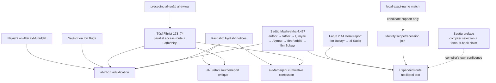

# Case 6 — Mashyakha expansion: ʿAbd Allāh b. Bukayr

**Research state:** case-study complete; source and local-corpus audit dated 2026-08-24

**Question:** what may legitimately be inserted before an abbreviated *Faqīh* report beginning `وروى عبد الله بن بكير`, and what does that insertion prove?
**Database scope:** read-only analysis of the local Four Books and Mashyakha tables. No production code, schema, identities, or grades were changed.

## 1. Result at a glance

Al-Ṣadūq prints this report with only ʿAbd Allāh b. Bukayr between the report and Imam al-Ṣādiq:

> `وروى عبد الله بن بكير عن أبي عبد الله عليه السلام أنه قال ...`

His Mashyakha supplies a route to every item introduced as being “from ʿAbd Allāh b. Bukayr”:

> `وما كان فيه عن عبد الله بن بكير فقد رويته عن أبي رضي الله عنه، عن عبد الله بن جعفر الحميري، عن أحمد بن محمد بن عيسى، عن الحسن بن علي بن فضال، عن عبد الله بن بكير.`

The mechanically expanded representation is therefore:

```text
al-Ṣadūq
  → his father, ʿAlī b. al-Ḥusayn b. Mūsā b. Bābawayh
  → ʿAbd Allāh b. Jaʿfar al-Ḥimyarī
  → Aḥmad b. Muḥammad b. ʿĪsā
  → al-Ḥasan b. ʿAlī b. Faḍḍāl
  → ʿAbd Allāh b. Bukayr
  → Abū ʿAbd Allāh al-Ṣādiq
```

That result is an **expanded access/isnād representation**, not the literal wording of the report. It makes five previously unprinted nodes visible and creates five narrator-evaluation questions. It does not answer them.

The example supplies an unusually strong control for this distinction:

- al-Khūʾī calls al-Ṣadūq's route `صحيح`;
- al-Ṭūsī's *Fihrist* preserves a parallel connected route to the same book and shares its three lowest links;
- al-Khūʾī nevertheless calls al-Ṭūsī's route weak because it passes through Abū al-Mufaḍḍal and Ibn Buṭṭa.

Thus `connected/musnad` and `accepted/sound` cannot be the same database field. Al-Ṭūsī's declaration that his routes take reports “out of the limit of marāsīl” says that a route is supplied; it nowhere says that every supplied route-person is thereby authenticated.

The target also prevents two further collapses. Al-Ṭūsī explicitly says that ʿAbd Allāh is Fāṭḥī **and** trustworthy, while al-Ḥasan b. ʿAlī b. Faḍḍāl was famously Fāṭḥī for most of his life. Sect and transmission reliability are separate claims. Moreover, al-Ṭūsī suspects ʿAbd Allāh of falsehood in one particular divorce report, while al-Khūʾī says that this report-specific possibility does not undo person-level reliability. Person, route, report, sect, and compiler practice therefore require separate objects.

| Layer | Defensible result in this example |
|---|---|
| literal *Faqīh* isnād | `عبد الله بن بكير → أبو عبد الله` |
| Mashyakha rule | exact formula applies to occurrences beginning with the exact target name, subject to identity and scope controls |
| expanded isnād | the five-node author-to-target prefix is added with `reconstructed_from_mashyakha` provenance |
| route topology | connected relative to the supplied Mashyakha route |
| al-Khūʾī's route judgment | `الطريق صحيح` for al-Ṣadūq; al-Ṭūsī's parallel route weak through Abū al-Mufaḍḍal and Ibn Buṭṭa |
| fourfold report label | method-sensitive; a classifier requiring Imāmī narrators may call it *muwaththaq*, despite al-Khūʾī's wording about the **route** |
| source-book inference | supported, but the proposition that every initial name in *Faqīh* identifies the exact book from which that report was copied remains disputed |

## 2. Edition and representation controls

The principal *Faqīh* citations use Muḥammad b. ʿAlī b. al-Ḥusayn al-Ṣadūq, *Man lā yaḥḍuruhu al-faqīh*, ed. ʿAlī Akbar al-Ghaffārī, Qom: Muʾassasat al-Nashr al-Islāmī/Jamāʿat al-Mudarrisīn, second ed. 1404 AH. Bibliographies sometimes give the corresponding solar year, 1363 Sh. The Mashyakha is printed at the end of vol. 4; a separate Dār al-Taʿāruf printing paginates the same entry at p. 15. Both are cited where useful.

Four representations must remain queryable:

| Representation | Contents | May it replace the preceding layer? |
|---|---|---|
| `isnad_raw` | the Arabic actually printed before the matn | no |
| `isnad_parsed` | nodes parsed from that literal string | no |
| `isnad_expanded` | parsed nodes plus a sourced Mashyakha/Fihrist prefix | no |
| `isnad_corrected` | a separately argued correction to a defective reading | no; not needed in the chosen report |

The arrows below express transmission direction from compiler toward Imam. Arabic source prose normally reads in the same direction, but labels such as “upper” and “lower” are avoided because their meanings reverse across diagrams.

## 3. The concrete abbreviated report

### 3.1 Literal text

Al-Ṣadūq, *al-Faqīh*, vol. 2, p. 44, report 1658 ([exact page, eShia](https://lib.eshia.ir/11021/2/44); [exact page, Ahlulbayt Digital Library](https://ablibrary.net/book_content/1341/44)):

> `١٦٥٨ ـ وروى عبد الله بن بكير عن أبي عبد الله عليه السلام أنه قال: «إني لآخذ من أحدكم الدرهم وإني لمن أكثر أهل المدينة مالا، ما أريد بذلك إلا أن تطهروا».`

The literal parsed chain is only:

```text
عبد الله بن بكير → أبو عبد الله عليه السلام
```

Nothing on this page names al-Ṣadūq's father, al-Ḥimyarī, Aḥmad b. Muḥammad b. ʿĪsā, or Ibn Faḍḍāl. A UI that displays those names without a reconstruction badge misquotes the book.

The initial formula `روى عبد الله بن بكير` is not the technical *mursal* form “a man reported from the Imam”; it names the last book-owner/transmitter from whom the report is presented. It is nevertheless abbreviated relative to the compiler: the reader has not yet been shown how al-Ṣadūq reaches Ibn Bukayr.

### 3.2 Independent corpus control on the lower segment

Al-Kulaynī transmits the same matn with an explicit lower route:

> `محمد بن يحيى، عن أحمد بن محمد، عن ابن فضال، عن ابن بكير قال: سمعت أبا عبد الله عليه السلام يقول: إني لآخذ من أحدكم الدرهم وإني لمن أكثر أهل المدينة مالا ما أريد بذلك إلا أن تطهروا.`

See al-Kulaynī, *al-Kāfī*, vol. 1, pp. 537–38, no. 7 ([viewer page containing the report](https://www.masaha.org/book/view/1/page/536)). This is valuable structural evidence for `أحمد بن محمد → ابن فضال → ابن بكير`, and its `سمعت` supports direct hearing by Ibn Bukayr from the Imam in this report. It does **not** make the *Kāfī* and *Faqīh* upper routes independent witnesses to the matn's ultimate origin: both may derive from the same lower transmission or written source.

## 4. Al-Ṣadūq's exact Mashyakha route

Al-Ṣadūq, *al-Faqīh*, vol. 4, p. 427 ([exact printed page](https://lib.eshia.ir/11021/4/427); [exact entry transcription](https://thaqalayn.net/ar/hadith/38/1/20/21)); the separately printed *Mashyakhat al-faqīh*, p. 15 ([exact page](https://ablibrary.net/book_content/b/12386/15)):

> `وما كان فيه عن عبد الله بن بكير فقد رويته عن أبي رضي الله عنه، عن عبد الله بن جعفر الحميري، عن أحمد بن محمد بن عيسى، عن الحسن بن علي بن فضال، عن عبد الله بن بكير.`

The trigger is explicit and scoped: `ما كان فيه عن عبد الله بن بكير`. Applied to report 1658, whose first named transmitter is exactly `عبد الله بن بكير`, it supplies this **prefix**:

```text
محمد بن علي بن الحسين بن موسى بن بابويه [الصدوق]
  → علي بن الحسين بن موسى بن بابويه [أبوه]
  → عبد الله بن جعفر الحميري
  → أحمد بن محمد بن عيسى
  → الحسن بن علي بن فضال
  → عبد الله بن بكير
```

The literal report supplies the final edge:

```text
عبد الله بن بكير → أبو عبد الله الصادق
```

The mechanically composed route is therefore:

```text
محمد بن علي بن الحسين بن موسى بن بابويه
  → علي بن الحسين بن موسى بن بابويه
  → عبد الله بن جعفر الحميري
  → أحمد بن محمد بن عيسى
  → الحسن بن علي بن فضال
  → عبد الله بن بكير
  → أبو عبد الله الصادق
```

### 4.1 What the operation assumes

The expansion is not string concatenation alone. It depends on explicit claims:

1. **Book scope:** “فيه” means reports in this *Faqīh* recension/context, not every occurrence of Ibn Bukayr in every work.
2. **Trigger identity:** the literal initial `عبد الله بن بكير` is the same historical person as the Mashyakha target. This is exceptionally strong here because of the full name, the al-Ṣādiq layer, and the matching Ibn Faḍḍāl book-line; `ابن بكير` alone is weaker.
3. **Formula scope:** `ما كان فيه عن` is treated as supplying al-Ṣadūq's access/transmission route to the named person's material.
4. **Join integrity:** the terminal person in the supplied prefix equals the initial person in the literal chain. The duplicate target is joined, not inserted twice.
5. **Recension integrity:** the route and report belong to compatible recensions. Page or entry numbers alone cannot establish this.
6. **No source overclaim:** the formula authorizes a route expansion. It does not by itself prove that the exact physical exemplar copied for report 1658 was Ibn Bukayr's own autograph book.

### 4.2 What new questions the expansion creates

Before expansion, a narrator-grader sees Ibn Bukayr and the Imam. Afterwards it must ask about al-Ṣadūq's father, al-Ḥimyarī, Aḥmad b. Muḥammad b. ʿĪsā, and al-Ḥasan b. ʿAlī b. Faḍḍāl, as well as the target. These are not editorial clutter: under a node-by-node theory of khabar authority, any one may control the route judgment.

The inserted edges also have a different evidential character from Ibn Bukayr's `سمعت` in the *Kāfī* parallel. They form a compiler's route to material/books. The database should therefore store `relation_type = access_route/transmission_route` unless the source independently asserts audition for an edge.

## 5. The parallel route in al-Ṭūsī's *Fihrist*

The relevant edition is al-Ṭūsī, *al-Fihrist*, ed. Jawād al-Qayyūmī, Qom: Muʾassasat Nashr al-Fiqāha, first ed. 1417 AH. In the chapter of persons named ʿAbd Allāh, the entry says (pp. 173–74: [preceding route](https://ablibrary.net/book_content/b/2684/173), [Ibn Bukayr entry](https://ablibrary.net/book_content/b/2684/174); [alternate exact page](https://lib.eshia.ir/14010/1/174)):

> `عبد الله بن بكير، فطحي المذهب، إلا أنه ثقة.`
>
> `له كتاب، رويناه بالإسناد الأول عن ابن بطة، عن أحمد بن محمد بن عيسى، عن الحسن بن علي بن فضال، عنه.`

One online transcription displays the bracketed entry as `[461]`, while another edition/cataloguing tradition gives `[463]` or 464. This is an edition/index discrepancy, not a reason to change the person. The stable identifiers are the Arabic incipit, chapter ordinal 31, printed pp. 173–74, and route text.

`بالإسناد الأول` is a backward reference, not a missing narrator. The immediately preceding first isnād reads on p. 173:

> `أخبرنا بهذا الكتاب جماعة عن أبي المفضل، عن ابن بطة، عن أحمد بن أبي عبد الله عنه.`

Al-Khūʾī explicitly resolves the cross-reference as:

> `وأراد بالإسناد الأول: جماعة، عن أبي المفضل، عن ابن بطة.`

The full *Fihrist* route to Ibn Bukayr's book is therefore:

```text
الشيخ الطوسي
  → جماعة
  → أبو المفضل الشيباني
  → ابن بطة
  → أحمد بن محمد بن عيسى
  → الحسن بن علي بن فضال
  → عبد الله بن بكير
```

Compare the two access paths:

```text
al-Ṣadūq → father → al-Ḥimyarī ┐
                                ├→ Aḥmad b. Muḥammad b. ʿĪsā
al-Ṭūsī → group → Abū al-Mufaḍḍal → Ibn Buṭṭa ┘
     → al-Ḥasan b. ʿAlī b. Faḍḍāl → ʿAbd Allāh b. Bukayr
```

The shared lower three-node segment corroborates the transmission lineage of Ibn Bukayr's book. It is not a second independent route to the wording of report 1658: al-Ṭūsī's entry catalogs a book and does not reproduce this matn.

## 6. “From marāsīl to musnadāt” is a structural statement

At the opening of the *Tahdhīb* Mashyakha, al-Ṭūsī explains why he is appending his routes. *Tahdhīb al-aḥkām*, ed. Ḥasan al-Mūsawī al-Khursān, Tehran: Dār al-Kutub al-Islāmiyya, fourth ed. 1407 AH, vol. 10, pp. 4–5 ([p. 4](https://lib.eshia.ir/10083/10/4), [p. 5](https://lib.eshia.ir/10083/10/5); [exact alternate transcription](https://books.rafed.net/view/753/page/5)):

> `والآن فحيث وفق الله تعالى للفراغ من هذا الكتاب نحن نذكر الطرق التي يتوصل بها إلى رواية هذه الأصول والمصنفات ونذكرها على غاية ما يمكن من الاختصار لتخرج الأخبار بذلك عن حد المراسيل وتلحق بباب المسندات.`

Al-Ḥurr al-ʿĀmilī quotes the same explanation when reproducing al-Ṭūsī's omitted routes ([*Wasāʾil al-shīʿa*, conclusion, exact page](https://ablibrary.net/book_content/5470/2)). The operative verbs are `نذكر الطرق` and `يتوصل بها إلى رواية هذه الأصول والمصنفات`: a route is disclosed to the sources whose author names had stood at the head of abbreviated reports. `تلحق بباب المسندات` describes the resulting topology.

Nothing in the sentence says:

- every person in every path is `ثقة`;
- every person is Imāmī;
- every named book attribution is textually uncontested;
- every report in the source is true;
- or every reconstructed report receives the later fourfold label `صحيح`.

The Ibn Bukayr control is decisive because al-Ṭūsī's own *Fihrist* route is fully spelled out and hence connected, yet al-Khūʾī grades it weak. The fields must be independent:

```text
route_connected = true
route_source = Tusi_Fihrist
route_person_assessments = mixed
route_accepted_under_Khui = false
reason = Abu_al_Mufaddal + Ibn_Butta
```

To call this route “musnad” is neither empty nor equivalent to calling it sound. It converts an unexplained author-name abbreviation into an inspectable chain. Precisely because the nodes become inspectable, a later critic can reject the route.

## 7. Early-source audit of ʿAbd Allāh b. Bukayr

### 7.1 Al-Najāshī: biography and a different book route

Al-Najāshī, *Rijāl*, ed. Mūsā al-Shubayrī al-Zanjānī, Qom: Muʾassasat al-Nashr al-Islāmī, fifth ed. 1416 AH, entry 581, p. 222 ([exact page](https://lib.eshia.ir/14028/1/222)):

> `عبد الله بن بكير بن أعين بن سنسن أبو علي الشيباني، مولاهم، روى عن أبي عبد الله عليه السلام وإخوته عبد الحميد والجهم وعمرو وعبد الأعلى ... له كتاب كثير الرواة، أخبرناه أحمد بن عبد الواحد، عن علي بن حبشي، عن حميد، عن أحمد بن الحسن البصري، عن عبد الله بن جبلة، عن عبد الله بن بكير به.`

This directly establishes identity, kunya, affiliation, transmission from al-Ṣādiq, book ownership, numerous book transmitters, and al-Najāshī's own book route. It contains no explicit `ثقة` and no Fāṭḥī label. Silence here must not be stored as weakening; the explicit positive reliability evidence comes from al-Ṭūsī and later uses of the Kashshī notice.

### 7.2 Al-Ṭūsī's *Rijāl*: ṭabaqa, not evaluation

Al-Ṭūsī lists him among the companions of al-Ṣādiq:

> `عبد الله بن بكير بن أعين ... الشيباني.`

See *Rijāl al-Ṭūsī*, companions of al-Ṣādiq, entry 27, printed around pp. 224–30 depending on edition ([the online viewer item that displays the entry](https://www.masaha.org/book/view/579/page/351)). The viewer's internal item number does not equal every print pagination. This is direct ṭabaqa evidence, not a tawthīq formula.

### 7.3 Al-Ṭūsī's *Fihrist*: sect plus explicit reliability

The already quoted *Fihrist* entry is the clearest early evaluation:

> `فطحي المذهب، إلا أنه ثقة.`

Its grammar is important. `فطحي المذهب` is a sect claim; `ثقة` is a reliability claim; `إلا أنه` expressly prevents the former from cancelling the latter. A single enum such as `status = FATHI_WEAK` would reverse the source.

### 7.4 Al-Barqī: companion-list identity data

Al-Barqī, *Rijāl*, companions of al-Ṣādiq, printed p. 22 ([exact online page](https://usul.ai/ar/t/rijal-al-barqi/22)):

> `عبد الله بن بكير بن أعين، من موالي بني شيبان، وكان يكنى أبا علي.`

This independently aligns the patronage and kunya with al-Najāshī. It is a list entry, not explicit reliability evidence.

### 7.5 Al-Kashshī: Fāṭḥī jurist and Aṣḥāb al-Ijmāʿ member

In al-Ṭūsī's surviving selection of al-Kashshī, Muḥammad b. Masʿūd al-ʿAyyāshī is reported as saying:

> `قال محمد بن مسعود: عبد الله بن بكير وجماعة من الفطحية هم فقهاء أصحابنا، منهم: عبد الله بن بكير، وابن فضال ـ يعني الحسن بن علي بن فضال ـ وعمار الساباطي، وعلي بن أسباط، وبنو الحسن بن علي بن فضال ـ علي وأخواه ـ ويونس بن يعقوب، ومعاوية بن حكيم؛ وعد عدة من أجلة الفقهاء العلماء.`

See al-Kashshī/al-Ṭūsī, *Ikhtiyār maʿrifat al-rijāl*, ed. al-Sayyid Mahdī al-Rajāʾī, Qom: Muʾassasat Āl al-Bayt, first ed. 1404 AH, vol. 2, p. 635, no. 639 ([exact viewer page](https://www.masaha.org/book/view/525/page/635)). Older one-volume citations commonly give p. 345. This is praise for learning and status, joined to a sect description; it does not literally say `ثقة`.

The second-six consensus notice includes him:

> `أجمعت العصابة على تصحيح ما يصح من هؤلاء وتصديقهم لما يقولون، وأقروا لهم بالفقه ... وهم ستة نفر: جميل بن دراج، وعبد الله بن مسكان، وعبد الله بن بكير، وحماد بن عيسى، وحماد بن عثمان، وأبان بن عثمان.`

See *Ikhtiyār*, vol. 2, p. 673, no. 705 ([exact viewer page](https://www.masaha.org/book/view/525/page/673)); older citations often give p. 375. This is a major later premise, but its scope is disputed. It must be stored as the actual formula rather than expanded into “every report and every Imam-side narrator is sound.”

The first notice is explicitly framed as al-ʿAyyāshī's statement preserved by al-Kashshī/al-Ṭūsī. The second is al-Kashshī's communal-consensus notice. Later citations of either are dependent adoptions, not new early witnesses.

## 8. Route-person audit: what expansion exposes

The following table does not substitute later aggregate grading for the sources. It shows why the expansion is evaluatively consequential.

| Route person | Direct evidence relevant here | Claim type | Consequence |
|---|---|---|---|
| ʿAlī b. al-Ḥusayn b. Mūsā b. Bābawayh | al-Najāshī: `شيخ القميين في عصره ومتقدمهم، وفقيههم، وثقتهم` (*Rijāl*, p. 261; [exact page](https://lib.eshia.ir/14028/1/261)) | status + reliability | positive inserted node |
| ʿAbd Allāh b. Jaʿfar al-Ḥimyarī | al-Najāshī: `أبو العباس القمي، شيخ القميين ووجههم` (*Rijāl*, entry 573, p. 219; [exact page](https://lib.eshia.ir/14028/1/219)); al-Ṭūsī calls him `ثقة` in the *Fihrist* | status plus explicit later-early tawthīq | positive inserted node |
| Aḥmad b. Muḥammad b. ʿĪsā | al-Najāshī: `شيخ القميين ووجههم وفقيههم غير مدافع، وكان أيضا الرئيس الذي يلقى السلطان` (*Rijāl*, entry 198, pp. 81–82; [p. 82](https://lib.eshia.ir/14028/1/82)); al-Ṭūsī also lists him as `ثقة` | status + explicit reliability | positive inserted node |
| al-Ḥasan b. ʿAlī b. Faḍḍāl | al-Ṭūsī: `كان فطحيا ... ثم رجع ... كان جليل القدر، عظيم المنزلة، زاهدا ورعا، ثقة في الحديث وفي رواياته` (*Fihrist*, entry 164, pp. 97–98; [exact p. 98](https://ablibrary.net/book_content/b/2684/98)); al-Najāshī preserves his long Fāṭḥī period and deathbed return ([*Rijāl*, pp. 34–35](https://lib.eshia.ir/14028/1/35)) | sect history + explicit transmission reliability | accepted by trust-based methods; prevents sect/reliability collapse |
| ʿAbd Allāh b. Bukayr | al-Ṭūsī: `فطحي المذهب، إلا أنه ثقة`; al-Kashshī notices add juristic stature/consensus | sect + reliability + scholarly status | accepted person under al-Khūʾī and al-Māmaqānī; report-level exceptions remain possible |

Al-Khūʾī's own aggregate check confirms the result: `والطريق صحيح`. That judgment is evidence about **his method's conclusion**, not an instruction to erase the underlying five assessments.

### 8.1 Why al-Ṭūsī's parallel fails al-Khūʾī's audit

The parallel *Fihrist* route adds two problematic named persons above the common lower segment.

Al-Najāshī, *Rijāl*, entry 1059, p. 396 ([exact page](https://lib.eshia.ir/14028/1/396)), says of Abū al-Mufaḍḍal al-Shaybānī:

> `كان سافر في طلب الحديث عمره، أصله كوفي، وكان في أول أمره ثبتا ثم خلط، ورأيت جل أصحابنا يغمزونه ويضعفونه.`
>
> `رأيت هذا الشيخ وسمعت منه كثيرا، ثم توقفت عن الرواية عنه إلا بواسطة بيني وبينه.`

This is criticism of transmission practice and later-life mixture, supported by al-Najāshī's direct encounter and the practice of his peers. It is not a sect label.

Of Muḥammad b. Jaʿfar b. Buṭṭa, al-Najāshī, entry 1019, pp. 372–73 ([exact continuation page](https://lib.eshia.ir/14028/1/373)), writes:

> `كان كبير المنزلة بقم، كثير الأدب والفضل والعلم، يتساهل في الحديث، ويعلق الأسانيد بالإجازات، وفي فهرست ما رواه غلط كثير. وقال ابن الوليد: كان محمد بن جعفر بن بطة ضعيفا مخلطا فيما يسنده.`

Here social and scholarly stature coexists with hadith-practice criticism and Ibn al-Walīd's explicit weakening. This is exactly the kind of mixed profile a boolean person record cannot represent.

The lower route remains the same and connected. The upper person evidence changes. Al-Khūʾī's contrast therefore functions almost like a controlled experiment:

```text
same target + same Aḥmad → Ibn Faḍḍāl → Ibn Bukayr segment
different compiler-side access prefix
    Ṣadūq prefix → accepted
    Ṭūsī prefix  → weak by Abū al-Mufaḍḍal and Ibn Buṭṭa
```

## 9. What al-Ṣadūq himself claims

Al-Ṣadūq's preface is stronger than a bare statement that he collected whatever reached him, but it remains a compiler claim with a defined object. *Al-Faqīh*, vol. 1, pp. 3–5 ([starting exact page](https://lib.eshia.ir/11021/1/3); [exact searchable transcription](https://thaqalayn.net/ar/chapter/34/1/1)):

> `ولم أقصد فيه قصد المصنفين في إيراد جميع ما رووه، بل قصدت إلى إيراد ما أفتي به وأحكم بصحته، وأعتقد فيه أنه حجة فيما بيني وبين ربي ـ تقدس ذكره وتعالت قدرته ـ وجميع ما فيه مستخرج من كتب مشهورة، عليها المعول وإليها المرجع ... وغيرها من الأصول والمصنفات التي طرقي إليها معروفة في فهرس الكتب التي رويتها عن مشايخي وأسلافي رضي الله عنهم.`

This directly supports three propositions:

1. al-Ṣadūq selected rather than exhaustively copied;
2. he personally judged the included material sound/probative;
3. he says it was extracted from famous relied-upon books and that his routes to those works were known.

It does not explicitly say that each person in each route receives an individual `ثقة` judgment. Nor does one compiler's `أحكم بصحته` bind a later scholar who defines probativity through node-level reliability. The engine should store the preface as `compiler_report_selection_claim` and `source_collection_claim`, not synthesize person-level tawthīqs from it.

## 10. Later scholarly adjudications

### 10.1 Al-Khūʾī: route acceptance, person reliability, and a report exception

Al-Khūʾī's analysis is in *Muʿjam rijāl al-ḥadīth*, vol. 11, pp. 130–33 ([p. 130](https://ablibrary.net/book_content/b/5178/130), [p. 131](https://ablibrary.net/book_content/b/5178/131), [p. 132](https://ablibrary.net/book_content/b/5178/132), [p. 133](https://ablibrary.net/book_content/b/5178/133)). He first quotes al-Ṭūsī's combined sect/reliability judgment and resolves `الإسناد الأول`. He then concludes on the person:

> `بقي أمران: الأول: أنك قد عرفت توثيق عبد الله بن بكير من الشيخ، والمفيد، وعلي بن إبراهيم، وعد الكشي إياه من أصحاب الإجماع، فلا ينبغي الإشكال في وثاقته وإن كان فطحيا.`

This is not “Fāṭḥism is irrelevant” in every respect. It is “Fāṭḥism does not prevent personal wathāqa.” A report-classification scheme requiring Imāmī belief may still distinguish *ṣaḥīḥ* from *muwaththaq*.

Al-Ṭūsī had discussed a divorce report and entertained the possibility that Ibn Bukayr said it in support of his own view. Al-Khūʾī refuses to promote that suspicion into a global person judgment:

> `وأما ما ذكره الشيخ في الاستبصار فلا ينافي الحكم بوثاقته، غايته أن الشيخ احتمل كذب عبد الله بن بكير في هذه الرواية بخصوصها نصرة لرأيه، ومن المعلوم أن احتمال الكذب لخصوصية في مورد خاص لا ينافي وثاقة الراوي في نفسه.`

This yields a precise ontology rule:

```text
claim(target = person, predicate = thiqa)
is compatible with
claim(target = particular_report, predicate = possible_deliberate_falsehood)
```

It does not follow that al-Khūʾī accepts the particular divorce report. It follows that he rejects the inference from a report-specific concern to global unreliability.

Finally he compares the two access paths on p. 132:

> `ثم إن طريق الصدوق إليه: أبوه رضي الله عنه، عن عبد الله بن جعفر الحميري، عن أحمد بن محمد بن عيسى، عن الحسن بن علي بن فضال، عن عبد الله بن بكير. والطريق صحيح، إلا أن طريق الشيخ إليه ضعيف بأبي المفضل وبابن بطة.`

This is the controlling methodological sentence for the case. Al-Khūʾī evaluates the route persons after reconstruction; he does not infer soundness from the fact that a route exists.

His treatment of al-Ṣadūq's preface makes the same point at the compiler level. *Muʿjam*, vol. 1, pp. 87–88 ([p. 87](https://www.masaha.org/book/view/1229/page/87), [p. 88](https://www.masaha.org/book/view/1229/page/88)):

> `أن دلالة هذا الكلام على أن جميع ما رواه الشيخ الصدوق في كتابه ـ من لا يحضره الفقيه ـ صحيح عنده، وهو يراه حجة فيما بينه وبين الله تعالى واضحة، إلا أنا قد ذكرنا: أن تصحيح أحد الأعلام المتقدمين رواية لا ينفع من يرى اشتراط حجية الرواية بوثاقة راويها أو حسنها.`
>
> `وعلى الجملة: إن إخبار الشيخ الصدوق عن صحة رواية وحجيتها إخبار عن رأيه ونظره، وهذا لا يكون حجة في حق غيره.`

The preface is real evidence of al-Ṣadūq's view; it is simply not dispositive under al-Khūʾī's epistemic premises.

### 10.2 Al-Tustarī: trust “in some measure,” source criticism, and no blanket report rule

Al-Tustarī gathers the early notices in *Qāmūs al-rijāl*, Qom: Muʾassasat al-Nashr al-Islāmī/Jamāʿat al-Mudarrisīn, 1410 AH, vol. 6, pp. 270–75 ([p. 270](https://ablibrary.net/book_content/b/13926/270), [p. 271](https://ablibrary.net/book_content/b/13926/271), [p. 272](https://ablibrary.net/book_content/b/13926/272), [p. 273](https://ablibrary.net/book_content/b/13926/273), [p. 274](https://ablibrary.net/book_content/b/13926/274), [p. 275](https://ablibrary.net/book_content/b/13926/275)). He does not merely repeat a grade. He distinguishes what al-Ṭūsī's formula proves from a supposed blanket validation:

> `وأما اعتراض الوافي فساقط. أما فهرسته: فلم يوثقه مطلقا، بل قال: «فطحي ثقة» ولم يستفد منه إلا أنه موثق كباقي الموثقين.`

He also rejects treating the *ʿUdda* as agreement on all Ibn Bukayr reports, pointing to the community's non-adoption of the contested divorce position:

> `فالرجل روى اشتراط العدّية في الاحتياج إلى المحلّل والإمامية لم يعتدّوا بخبره.`

His own bottom line is qualified rather than wholly negative:

> `وأما سكوت النجاشي فيه: فأعم ... مع أنه لم يذكر وثاقته، وهي في الجملة محققة.`

`في الجملة` matters. Al-Tustarī accepts some degree of established reliability while resisting a rule that validates every report by this narrator. In the disputed divorce material, he also separates Ibn Bukayr's interpretation from what ʿUbayd transmitted:

> `إن الحديث على ما رواه عبيد، وليس على ما تأوله ابن بكير.`

That is a possible interpretive error at report level, not simply a sect label or a global narrator grade.

For the chosen charity report, *Qāmūs* supplies no identified report-specific defect. A Tustarī-like method may therefore recognize the Mashyakha expansion and the established trust “in some measure,” while still refusing two automatic inferences: (a) every Ibn Bukayr report is accepted, and (b) al-Ṣadūq's initial name proves the exact physical source book.

Al-Tustarī's *tamyīz* note on p. 275 is also directly relevant to automation:

> `إلا أن الظاهر سقوط الواسطة بينهم وبينه؛ فيبعد إدراك هؤلاء له.`

and, in another apparent occurrence:

> `لكن «ابن بكير» فيه محرّف «بكير» كما رواه الكافي.`

A route engine must therefore be able to withhold expansion or propose a textual correction where ṭabaqa or a parallel makes the surface string impossible. The existence of a Mashyakha rule does not license matching every `ابن بكير` token.

### 10.3 Al-Māmaqānī: cumulative acceptance “under the rule of ṣaḥīḥ”

The older *Tanqīḥ al-maqāl* gives an unmistakable authorial conclusion. The host's digital items 173–74 display section 1, printed pp. 171–72 ([printed p. 171](https://ablibrary.net/book_content/b/18291/173), [printed p. 172](https://ablibrary.net/book_content/b/18291/174)):

> `وتحقيق المقال أن الحق والإنصاف كون حديث الرجل بحكم الصحيح، لتوثيق الشيخ رحمه الله إياه في فهرسته، وقوله في العدة إن الطائفة عملت بما رواه عبد الله بن بكير، وعد الكشي إياه ممن أجمعت العصابة على تصحيح ما يصح عنه ...`
>
> `فرفع اليد عن هذه الشهادات القويمة والتصديقات القوية لمجرد رمي الرجل بالفطحية لا وجه له، بل اللازم الأخذ بها وترتيب آثار الصحيح على أحاديثه وترك التشكيك فيها.`
>
> `وبالجملة فجريان حكم الخبر الصحيح على ما يرويه الرجل مما لا ينبغي الارتياب فيه.`

On the next page he strengthens the cumulative case through the large number and stature of transmitters from him:

> `ثم انظر وفقك الله تعالى لخير الدارين هل تجوز من نفسك رد رواية مثل هذا الرجل الذي روى عنه هؤلاء الجماعة الكثيرة الذين جملة وافية منهم ثقات أجلاء وجملة منهم من أصحاب الإجماع، حاشا وكلا لا يمكن الالتزام بذلك.`

This reasoning is materially broader than al-Khūʾī's. It combines al-Ṭūsī's explicit tawthīq, the *ʿUdda* practice claim, the Kashshī consensus notice, and corpus/social evidence from numerous eminent transmitters. These are multiple **premises**, but not all are independent testimonies: the consensus premise is one early lineage repeated later, and the *ʿUdda* may itself be historically related to the community-practice understanding.

The revised Āl al-Bayt series was also audited for the requested `حصيلة البحث`. The accessible catalog currently located runs through vol. 39, whose range begins around `عباية، عبد الرحمن` ([catalog record](https://alfeker.net/library.php?id=4581)). ʿAbd Allāh b. Bukayr falls alphabetically later, and no revised-volume entry or explicit revised `حصيلة البحث` for him was located in the surveyed series. It would be fabrication to supply one. The old edition's actual `تحقيق المقال` and final conclusion are quoted above; the revised `حصيلة البحث` remains a precise source gap.

### 10.4 Al-ʿAllāma al-Ḥillī: explicit practical adoption

Al-ʿAllāma's *Khulāṣat al-aqwāl*, p. 195 (the available PDF is [complete-work, not exact-page, access](https://download.almohsinlibrary.com/RJH/RJH034.pdf)), combines the same early premises:

> `قال الشيخ الطوسي رحمه الله: إنه فطحي المذهب إلا أنه ثقة ... وقال في موضع آخر: إن عبد الله بن بكير ممن اجتمعت العصابة على تصحيح ما يصح عنه وأقروا له بالفقه. فأنا أعتمد على روايته وإن كان مذهبه فاسدا.`

The last sentence is al-ʿAllāma's own adoption; the preceding clauses depend on al-Ṭūsī and al-Kashshī. In actual fiqh he repeats the distinction: `عبد الله بن بكير وإن كان فطحيا إلا أن المشايخ وثقوه`; *Mukhtalaf al-shīʿa*, vol. 3, p. 76 ([exact page](https://www.masaha.org/book/view/843/page/76)). This is useful practice evidence but not independent early tawthīq.

### 10.5 Al-Sīstānī's source-provenance caution

A distinct modern question is whether al-Ṣadūq always begins a report with the owner of the exact book from which he copied it. *Qabasāt min ʿilm al-rijāl*, research of al-Sayyid Muḥammad Riḍā al-Sīstānī, collected by al-Sayyid Muḥammad al-Bakkāʾ, Beirut: Dār al-Muʾarrikh al-ʿArabī, first ed. 1437/2016, vol. 2, p. 233 ([exact page](https://www.masaha.org/book/view/5418/page/233)), identifies the premise rather than assuming it:

> `وهذا الكلام مبني على أن الصدوق قدس سره لا يبتدأ في الفقيه إلا باسم من أخذ الحديث من كتابه أو أصله، أي أنه مثل الشيخ الذي صرح في مشيخة التهذيبين بتقيده بذلك ...`

After testing the practice, the study concludes at p. 252 ([exact page](https://www.masaha.org/book/view/5418/page/252)):

> `بل الشواهد الواضحة على أنه أخذ معظم الأحاديث التي أوردها في الفقيه من جوامع الحديث وأن الطرق المذكورة في المشيخة إنما هي في معظمها طرق إلى روايات المذكورين فيها لا إلى كتبهم إلا في بعض الموارد القليلة ...`

This does not invalidate the mechanical route formula `وما كان فيه عن عبد الله بن بكير`. It narrows the provenance conclusion. The safe assertions are:

- al-Ṣadūq supplies a route to transmissions presented from Ibn Bukayr;
- the route can be joined to an exact-name occurrence;
- the *Fihrist* and *Kāfī* parallels strengthen the lower transmission lineage;
- but the initial name alone does not prove that al-Ṣadūq copied report 1658 directly from Ibn Bukayr's own book rather than from a later compilation carrying his report.

Al-Ṭūsī's case is different because he explicitly states his convention about beginning with the author/source-owner. The engine must not silently transfer al-Ṭūsī's stated editorial rule to al-Ṣadūq.

## 11. Local corpus and database evidence

### 11.1 Snapshot and table separation

The read-only snapshot audited on 2026-08-24 already preserves the right conceptual separation:

- `hadiths.isnad_raw` retains the report's literal chain;
- `mashyakha_paths.source_text_ar` retains the route formula;
- `mashyakha_expansions` records a proposed relation between a path and a report, with match method and review state.

The chosen report is `faqih-1658`, vol. 2, p. 44. Its literal chain record is:

```text
وَرَوَى عَبْدُ اللَّهِ بْنُ بُكَيْرٍ عَنْ أَبِي عَبْدِ اللَّهِ ع أَنَّهُ قَالَ:
```

Its associated chain id is 153357. The expansion proposal is id 511, matched as `exact_first_narrator` and currently `proposed`. The route is `mashyakha_paths.id = 20`; its stored Arabic agrees with the printed formula quoted above, and its source URL is `https://thaqalayn.net/chapter/38/1/20`.

These IDs are project-local and may change after migration. The stable scholarly identifiers are the work, volume/page/report, literal Arabic, target person claim, and route-source passage.

### 11.2 Aggregate behavior

The snapshot contains 387 Mashyakha path records:

| review state | rows |
|---|---:|
| `parsed` | 378 |
| `needs_review` | 4 |
| `topic_entry` | 5 |
| **total** | **387** |

It contains 3,470 candidate/proposed expansions:

| match method | state | rows |
|---|---|---:|
| `exact_first_narrator` | `proposed` | 1,450 |
| `canonical_first_narrator` | `proposed` | 94 |
| `ism_nisba_elision` | `proposed` | 24 |
| `unique_name_extension` | `proposed` | 300 |
| `unique_name_extension` | `needs_review` | 2 |
| `partial_name_candidate` | `needs_review` | 1,590 |
| `exact_first_narrator` | `needs_review` | 10 |
| **total** |  | **3,470** |

These are project parser/database counts, not claims about the number of routes or reports in a critical edition. They describe current machine behavior and are intentionally dated.

### 11.3 Behavior for path 20

For the full-name target `عبد الله بن بكير`, the snapshot proposes four exact-first-narrator expansions:

| report | volume/page | state |
|---|---|---|
| `faqih-1658` | 2/44 | `exact_first_narrator`, `proposed` |
| `faqih-3932` | 3/260 | `exact_first_narrator`, `proposed` |
| `faqih-4353` | 3/387 | `exact_first_narrator`, `proposed` |
| `faqih-4834` | 3/533 | `exact_first_narrator`, `proposed` |

Ten reports beginning with the shorter `ابن بكير` remain `partial_name_candidate / needs_review`: `faqih-1796`, `faqih-1940`, `faqih-2541`, `faqih-2909`, `faqih-3444`, `faqih-3853`, `faqih-4280`, `faqih-4386`, `faqih-4855`, and `faqih-5434`.

That asymmetry is correct. Even if most of these ten eventually resolve to ʿAbd Allāh, the surface string can denote another Ibn Bukayr, conceal corruption, or occur in a context whose first-narrator boundary was parsed incorrectly. Al-Tustarī's `ابن بكير`/`بكير` correction demonstrates that this is a real textual problem, not theoretical caution.

### 11.4 A systemic false-positive control

The danger is visible outside this path. For the nearby Mashyakha target ʿAbd Allāh b. Abī Yaʿfūr, partial-name matching has generated review candidates for reports whose literal first narrator is Abū Wallād (project expansion rows 331, 600, and 2762). They are correctly not approved. A system that treats `partial_name_candidate` as an expansion fact will manufacture routes even before it reaches narrator grading.

The safe pipeline is:

```text
literal first-narrator occurrence
  → candidate historical person(s)
  → exact Mashyakha target/person claim
  → scope + recension + join checks
  → proposed expanded route
  → human/rule review where ambiguity remains
  → methodology-specific route evaluation
```

Identity confidence and route reliability are different axes. A certain identity can lead to a weak path; an uncertain identity must block a high-confidence expansion even if the candidate person's own reliability is excellent.

## 12. Evidence-dependency graph



Critical non-entailments:

```text
F + M + identity join
    ⇒ a sourced expanded route
    ⇏ every inserted person is reliable

Ṭūsī Fihrist + al-isnād al-awwal
    ⇒ a connected parallel book route
    ⇏ an independent witness to report 1658's matn

Ṣadūq preface
    ⇒ al-Ṣadūq considered the selected reports sound/probative
    ⇏ al-Khūʾī or another node-based critic must accept them

Kashshī notice repeated by al-ʿAllāma, al-Khūʾī, and al-Māmaqānī
    ⇒ one early evidence lineage plus differing later interpretations
    ⇏ three independent early tawthīqs

Fāṭḥī
    ⇏ weak

thiqa person
    ⇏ every individual report is true
```

### 12.1 Dependency classification

| Claim used later | Earliest located source layer | Later relationship |
|---|---|---|
| Ibn Bukayr is Fāṭḥī yet trustworthy | al-Ṭūsī, *Fihrist* | quoted/adopted by al-ʿAllāma, al-Khūʾī, al-Tustarī, al-Māmaqānī |
| he is among the Fāṭḥī jurists | al-ʿAyyāshī statement preserved in al-Kashshī/al-Ṭūsī | compiled by later rijāl works; not independent testimony |
| second-six consensus formula | al-Kashshī material in al-Ṭūsī's *Ikhtiyār* | scope interpreted broadly by al-Māmaqānī, more narrowly by al-Khūʾī/al-Tustarī |
| he has a widely transmitted book | al-Najāshī, with his own route | independently converges with al-Ṭūsī's separate catalog route |
| Ṣadūq route is sound | al-Khūʾī's node-level derivation from the Mashyakha route and person evidence | independent later inference, not a quotation from al-Ṣadūq |
| Ṭūsī route is weak | al-Khūʾī combines the route with al-Najāshī's criticisms of two nodes | independent later inference from earlier premises |
| reports should be treated `بحكم الصحيح` | al-Māmaqānī's cumulative inference | depends on several early premises; conclusion is his own |
| initial *Faqīh* name may not be exact source-book owner | al-Sīstānī study of compiler practice | independent corpus/source-critical inference |

## 13. Methodology-specific adjudication

There is no honest context-free grade. There is a stable reconstruction plus method-indexed evaluations.

| Method profile | Expansion decision | Route/person decision | Report 1658 outcome |
|---|---|---|---|
| **literalist display** | retain only printed `عبد الله بن بكير → أبو عبد الله` in the literal field; show expansion separately | no conclusion from abbreviation alone | not gradable from literal author-to-Imam path without consulting the route layer |
| **mechanical reconstruction** | exact full-name trigger + exact Mashyakha entry + coherent join: expand with high confidence | topology only; no automatic authentication | `expanded_connected`, evaluation pending |
| **al-Khūʾī-like node method** | expand | Ṣadūq path `صحيح`; target trustworthy despite Fāṭḥism; Ṭūsī parallel weak by Abū al-Mufaḍḍal/Ibn Buṭṭa | route accepted; preserve that a later fourfold classifier may label the report *muwaththaq* because of Fāṭḥī trusted persons |
| **al-Māmaqānī cumulative method** | expand | explicit tawthīq + *ʿUdda* practice + Aṣḥāb al-Ijmāʿ + eminent transmitters yield `بحكم الصحيح` | strongly accepted, absent a report-specific counter-indicator |
| **al-Tustarī-like source-critical method** | exact case may be expanded; partial names require ṭabaqa/parallel control | trust `في الجملة`; no blanket validation of all Ibn Bukayr reports | no identified defect in this matn, but exact source-book provenance is not established merely by the initial name |
| **strict explicit-tawthīq, trust-not-sect method** | expand | each inserted node must be independently acceptable; the located Ṣadūq path passes that audit | accepted as reliable route; if “ṣaḥīḥ” technically requires Imāmī narrators, classify as *muwaththaq*, not *ṣaḥīḥ* |
| **strict exact-source-book provenance method** | expansion is a route to Ibn Bukayr's transmissions | suspend the claim that report 1658 was copied from Ibn Bukayr's own book unless more source evidence is supplied | `route_connected`; `physical_source_book = tawaqquf` |

### 13.1 The correct default resolution

For this exact occurrence, Usul16 should resolve the expansion with high confidence because the full target name, Mashyakha formula, layer, and parallel lower route converge. The result should be:

```yaml
literal_isnad:
  text: "عبد الله بن بكير عن أبي عبد الله"
  immutable: true

expansion_claim:
  status: accepted_reconstruction
  certainty: high
  source: "Faqih 4:427, Mashyakha formula"
  match_method: exact_first_narrator
  inserted_nodes:
    - "علي بن الحسين بن موسى بن بابويه"
    - "عبد الله بن جعفر الحميري"
    - "أحمد بن محمد بن عيسى"
    - "الحسن بن علي بن فضال"
  join_person: "عبد الله بن بكير بن أعين"
  relation_type: access_transmission_route

route_adjudications:
  khui: accepted_sahih_route
  mamaqani: accepted_bihukm_al_sahih
  tustari_like: connected_and_person_trust_in_some_measure

source_book_claim:
  value: possible_or_supported
  not_equal_to: proven_exact_physical_exemplar
```

This is a specification sketch, not a production-schema change.

### 13.2 When tawaqquf is required

Withhold or qualify expansion when any of the following applies:

1. the report begins only `ابن بكير` and more than one candidate fits;
2. ṭabaqa makes the joined edge improbable or impossible;
3. a parallel shows `بكير` where the working copy has `ابن بكير`;
4. the apparent first narrator is actually continued from a preceding chain, a pronoun, or a taʿlīq boundary parsed incorrectly;
5. the Mashyakha formula belongs to a different recension or target homonym;
6. the formula is topical rather than a person route;
7. an `الإسناد الأول` or similar backward reference cannot be resolved securely;
8. a methodology requires proof of exact source-book provenance and only the generic Mashyakha route is available.

Tawaqquf on **identity**, **route topology**, **route reliability**, or **exact source book** must be stored separately. Uncertainty in one does not automatically erase conclusions on the others.

## 14. What a naïve database would get wrong

1. **Overwrite the literal chain.** It would replace `عبد الله بن بكير → الإمام` with the seven-node reconstruction and later present inserted names as al-Ṣadūq's printed words.
2. **Treat a string match as a historical identity.** `ابن بكير` would be silently equated with ʿAbd Allāh b. Bukayr even where ṭabaqa or a parallel points elsewhere.
3. **Expand outside scope.** A route beginning `وما كان فيه` would be applied to other books or to every database occurrence of the target.
4. **Duplicate the join node.** It would append the full Mashyakha route before an already printed Ibn Bukayr and produce `Ibn Bukayr → Ibn Bukayr`.
5. **Call every route edge direct audition.** Book-access/ijāza relations would be rewritten as `سمع من` claims.
6. **Set `musnad = ṣaḥīḥ`.** Al-Ṭūsī's connected but al-Khūʾī-weak path directly falsifies that rule.
7. **Infer person tawthīq from compiler selection.** Al-Ṣadūq's preface would generate unprinted `ثقة` claims for every route person.
8. **Convert sect into unreliability.** Both Ibn Bukayr and Ibn Faḍḍāl would be rejected simply because they were Fāṭḥī, contrary to explicit early formulas.
9. **Convert person reliability into report infallibility.** Al-Ṭūsī's particular divorce-report criticism would either be deleted or wrongly globalized.
10. **Count the *Fihrist* as a second matn witness.** A catalog route to a book would artificially double corroboration for report 1658.
11. **Leave `بالإسناد الأول` unresolved.** The route would look shorter than the source intends, hiding Abū al-Mufaḍḍal and thereby hiding al-Khūʾī's reason for weakening it.
12. **Trust entry/page IDs across editions.** The bracketed *Fihrist* number and online viewer item would be treated as immutable despite documented pagination/numbering divergence.
13. **Collapse scholar wording into one grade.** `الطريق صحيح`, `موثق`, `بحكم الصحيح`, and `وثاقته في الجملة محققة` would become one undocumented boolean.
14. **Treat dependent citations as votes.** Al-ʿAllāma, al-Khūʾī, al-Tustarī, and al-Māmaqānī repeating al-Ṭūsī's sentence would be counted as four independent tawthīqs.
15. **Infer exact physical source from the first name.** It would ignore the compiler-practice evidence summarized in *Qabasāt*.
16. **Promote parser totals to edition facts.** The 3,470 current expansion rows would be cited as a textual count in *al-Faqīh*.

## 15. Source-to-claim ledger

| Source passage | Exact location/access | Direct claim | Does not by itself prove |
|---|---|---|---|
| *Faqīh* report 1658 | vol. 2, p. 44; [exact](https://ablibrary.net/book_content/1341/44) | literal Ibn Bukayr → al-Ṣādiq report and matn | al-Ṣadūq-to-Ibn Bukayr route |
| *Faqīh* Mashyakha | vol. 4, p. 427; [exact](https://lib.eshia.ir/11021/4/427) | al-Ṣadūq's route formula to Ibn Bukayr transmissions | trust of every node; exact copied exemplar |
| *Faqīh* preface | vol. 1, pp. 3–5; [exact start](https://lib.eshia.ir/11021/1/3) | al-Ṣadūq's selection, correctness/probativity view, famous-book claim | binding correctness under another scholar's method |
| al-Najāshī on Ibn Bukayr | p. 222; [exact](https://lib.eshia.ir/14028/1/222) | identity, Imam transmission, book, separate route | explicit tawthīq or sect label |
| al-Ṭūsī, *Rijāl* | companions of al-Ṣādiq, entry 27; [viewer](https://www.masaha.org/book/view/579/page/351) | ṭabaqa/listing | reliability |
| al-Barqī | p. 22; [exact](https://usul.ai/ar/t/rijal-al-barqi/22) | kunya, patronage, companion-list identity | reliability |
| al-Kashshī/al-ʿAyyāshī | vol. 2, p. 635; [exact](https://www.masaha.org/book/view/525/page/635) | Fāṭḥī jurist and eminent scholar | literal `ثقة`; every report sound |
| al-Kashshī consensus | vol. 2, p. 673; [exact](https://www.masaha.org/book/view/525/page/673) | actual Aṣḥāb al-Ijmāʿ formula | agreed broad interpretation of that formula |
| al-Ṭūsī, *Fihrist* | pp. 173–74; [exact target page](https://ablibrary.net/book_content/b/2684/174) | Fāṭḥī + trustworthy, book, parallel route | soundness of upper route; matn corroboration |
| al-Ṭūsī, *Tahdhīb* Mashyakha intro | vol. 10, pp. 4–5; [exact alternate](https://books.rafed.net/view/753/page/5) | routes attach abbreviated source reports to musnad category | every route person trustworthy |
| al-Najāshī on Abū al-Mufaḍḍal | p. 396; [exact](https://lib.eshia.ir/14028/1/396) | late mixture and peer weakening | automatic weakness of unrelated persons/routes |
| al-Najāshī on Ibn Buṭṭa | pp. 372–73; [exact continuation](https://lib.eshia.ir/14028/1/373) | hadith laxity, catalog errors, Ibn al-Walīd weakening | absence of scholarly/social stature |
| al-Khūʾī | vol. 11, p. 132; [exact](https://ablibrary.net/book_content/b/5178/132) | Ṣadūq route sound; Ṭūsī route weak through two nodes; person/report distinction | universal acceptance under other premises |
| al-Tustarī | vol. 6, pp. 270–75; [start](https://ablibrary.net/book_content/b/13926/270) | qualified trust, critique of blanket readings, report/tamyīz analysis | global weakness or global report validation |
| al-Māmaqānī | old ed., section 1, printed pp. 171–72; [p. 171](https://ablibrary.net/book_content/b/18291/173) | cumulative `بحكم الصحيح` conclusion | an independently located revised `حصيلة البحث` |
| al-Sīstānī research, *Qabasāt* | vol. 2, pp. 233, 252; [p. 252](https://www.masaha.org/book/view/5418/page/252) | initial name/Mashyakha path often concerns transmissions, not necessarily exact owned source book | invalidity of the route formula itself |

## 16. Claim-level output for an engine

| Claim | Target object | Polarity/status | Provenance/dependency |
|---|---|---|---|
| the occurrence says `عبد الله بن بكير` | narrator occurrence in `faqih-1658` | certain | literal *Faqīh* page |
| occurrence = ʿAbd Allāh b. Bukayr b. Aʿyan | identity claim | very strong | full name + Imam layer + Mashyakha target + parallels |
| Mashyakha route applies | occurrence-to-route claim | high confidence | exact formula + scope/join checks |
| inserted nodes are literal report text | representation claim | denied | comparison of report and Mashyakha pages |
| the expanded route is connected | route-topology claim | affirmed | mechanical composition |
| the expanded route is accepted by al-Khūʾī | method adjudication | affirmed | *Muʿjam* vol. 11, p. 132 |
| al-Ṭūsī's parallel route is connected | route-topology claim | affirmed | *Fihrist* + resolved cross-reference |
| al-Ṭūsī's parallel route is accepted by al-Khūʾī | method adjudication | denied | Abū al-Mufaḍḍal + Ibn Buṭṭa |
| Ibn Bukayr is Fāṭḥī | person-sect claim | affirmed | al-Ṭūsī, Kashshī/ʿAyyāshī |
| Ibn Bukayr is trustworthy | person-reliability claim | affirmed under major cited methods | al-Ṭūsī direct; differing later adoption |
| every Ibn Bukayr report is sound | blanket report rule | denied by al-Tustarī; not entailed by al-Khūʾī | later interpretive dispute |
| report 1658 was copied from Ibn Bukayr's own physical book | source-provenance claim | supported possibility, not established | famous-book statement + parallels versus *Qabasāt* caution |

## 17. Reproducibility and remaining source gaps

The conclusions above are complete enough for implementation, with the following limits preserved rather than concealed:

1. **Al-Māmaqānī revised hasila:** no explicit revised-edition `حصيلة البحث` for ʿAbd Allāh b. Bukayr was located in the currently surveyed Āl al-Bayt volumes. The older edition's explicit `تحقيق المقال` and conclusion were located and quoted.
2. **Al-Ṭūsī *Rijāl* pagination:** online viewer index and print page differ across editions. The source supplies a ṭabaqa listing only, so the entry text and section are given with the viewer caveat.
3. **Al-Ṭūsī *Fihrist* number:** bracketed number differs among transcriptions. Printed pages and Arabic route control the identification.
4. **Kashshī pagination:** modern two-volume pp. 635/673 correspond to older one-volume pp. 345/375. Both traditions are stated; exact modern viewer pages are linked.
5. **Exact physical source book:** the route and lower book lineage are strong; the stronger claim that al-Ṣadūq copied this report directly from Ibn Bukayr's own book remains method-sensitive.
6. **Corpus counts:** all local totals are dated parser/database observations, not critical-edition totals and not external evidence of authenticity.

No unresolved gap prevents the central finding: report 1658 has a high-confidence Mashyakha expansion; that expansion must remain separately sourced; and its conversion from abbreviated to connected creates, rather than answers, route-person questions. The differing outcomes of al-Ṣadūq's and al-Ṭūsī's paths prove that topology, narrator reliability, sect, report criticism, and source provenance must remain independent dimensions.
